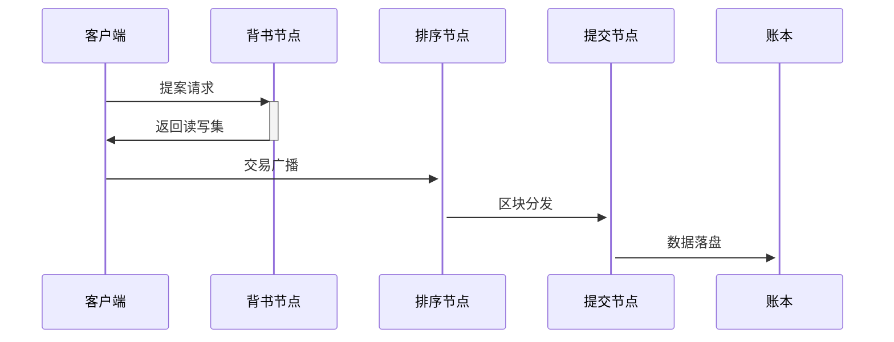

# Hyperledger Fabric 联盟链网络实操部署指南（二）

> 本文详细介绍了Hyperledger Fabric多主机网络部署的全流程，包括Docker Swarm集群搭建、加密材料生成、节点服务启动、通道创建与管理、链码部署及交互验证等核心步骤，并解析了交易三阶段流程和节点角色分工，为联盟链环境配置提供完整实践指南。

*📝 搬运自个人学习笔记 | 写于2022-04-25 16:44*

## 一、整体流程

1.  启动两台包含相关环境的主机。
2.  利用docker swarm形成一个覆盖网络并使所有两个主机加入。
3.  准备主机 1 上的证书文件和通道配置文件，然后将整个文件结构复制到所有其他主机。
4.  使用 docker-compose 顺利启动所有节点。
5.  创建一个通道并将所有节点加入 mychannel。
6.  安装并实例化 Fabcar 链码。
7.  调用和查询链码函数。

***

## 二、具体步骤

### 1、启动主机

（1）前提：我们可以利用ssh打开其它主机终端（没有伙伴的话，有的话就和伙伴协同工作）。
这里注意，如果是同一个局域网同网段的话，需要在hosts文件中加入伙伴主机的主机名和IP地址，然后重启网络。（不同Ubuntu版本重启网络的命令稍有不同，或者直接重启主机）

```shell
# 打开hosts
sudo gedit /etc/hosts
<主机名> <IP地址>
# 重启
sudo /etc/init.d/network-manager restart

# 可以ping测试一下
ping <IP地址>
# 重启网络(Ubuntu 20.0.4 LTS)
sudo systemctl restart NetworkManager
# 连接伙伴主机
ssh -i <key> -p <端口，默认22> user<公网IP或者同局域网同网段的私网IP或者Hosts中的主机名>
```

利用SSH的话，相互之间传输文件等工作就很方便。这里上一张hosts的图：


（2）在有防火墙的情况下，需要对所有内容（所有 UDP、TCP 和 ICMP）打开、生成一个安全组。当然，确保只打开所需的端口。

> 注意：Docker-swarm 必须打开以下端口:
>
> *   2377 (TCP) — 集群管理
> *   7946 (TCP and UDP) — 节点通信
> *   4789 (TCP and UDP) — 覆盖网络流量

```shell
# 打开防火墙的脚本如下：
firewall-cmd --zone=public --add-port=2375/tcp --permanent
firewall-cmd --zone=public --add-port=2377/tcp --permanent
firewall-cmd --zone=public --add-port=7946/tcp --permanent
firewall-cmd --zone=public --add-port=7946/udp --permanent
firewall-cmd --zone=public --add-port=4789/tcp --permanent
firewall-cmd --zone=public --add-port=4789/udp --permanent
firewall-cmd --reload
```

***

### 2、使用 Docker Swarm 形成一个 Overlay 网络

在主机1上，创建swarm集群：

将主机1初始化为manager，其他主机或为manager或为worker

```shell
docker swarm init --advertise-addr <主机1IP地址:端口2377> --listen-addr <主机1IP地址:端口>
```

创建成功之后，一般会另外生成一个其他主机以worker身份加入swarm集群的命令，让其他主机执行即可。如果其他主机需要manager身份，主机1则执行以下命令，生成manager身份的命令。

```shell
docker swarm join-token manager
```

然后可以重新命名网络

```shell
docker network create -d overlay --attachable test
```

我们推荐其他主机均以manager身份加入集群，因为这样的话，当其他主机掉出集群时，他自己可以通过`docker network ls`知道。上图如下：


在这一步，我们需要快点将其他所有主机作为管理员添加到这个群。

***

### 3、在主机1中准备好Fabric文件并复制给其他主机

关键部分之一是确保所有组件共享相同的加密文件。

我们将使用主机1上执行`./create-artifacts.sh`生成证书和通道配置（具体介绍可见文件目录配置那一篇文章）。关于`create-artifacts.sh`脚本的执行过程如下，先上代码截图：


成功执行的结果截图如下：


我们可以看到执行结果的截图中，已经成功生成创始区块，通道配置文件，各组织锚节点文件。

> 在讲解代码之前,我想对“通道”作一些讲解。在fabric的学习中，我们常说“通道”一词，它其实指的是应用通道的意思。实际上，在fabric中，通道是分为两种的，一种是以上说的应用通道（Application Channel），还有一种就是系统通道（System Channel）。多嘴一句，应用通道是由排序节点（各节点或组织的代表）划分和管理的私有原子广播通道，它的作用就是通道内节点之间传递交易信息并保证通道外的实体无法访问获取通道内的信息。那么系统通道呢？他是被排序节点用来管理应用通道的。


再多讲一句，值得一提的是，现在Fabric2.3版本支持有系统通道和无系统通道两种模式的排序节点。

*   如果是有系统通道的模式，那么是不支持channel join和channel remove操作的，同样如果是使用solo模式或者kafka模式，两者也不支持。
*   不支持混合模式，即不支持已经有了系统通道，又需要通过无系统通道来建立新的应用通道。这种情况需要按照原有的创建通道方法，或者需要先将系统通道移除

回到正题，在讲清楚红色标记处这三者关系后，以下我将对这些代码做一些讲解,这些讲解以注解的形式穿插在下面的代码块中:

```shell
# 声明环境变量（当前文件夹下的bin文件、当前文件夹、已有环境变量）
export PATH=${PWD}/bin:${PWD}:$PATH

拓展：
Fabric——基础联盟链框架，其将整个过程分成了三个阶段：
业务背书阶段：客户的请求发送的背书节点，通过智能合约完成业务的计算（但不更新状态），并完成背书；将背书结果返回个客户端。
业务的排序阶段：客户端将背书结果通过Channel被发送到排序节点（orderer），在排序节点完成事务的排序，并打包到block里，最后下发给所有连接到channel的节点。
业务验证并写入账本阶段：通过Gossip 网络，所有Channel的节点都会接收到新的block，节点会验证block中的每一个事务，确定是否有效：有效地将会跟新world state，无效的将会标志为“无效”，不会更新World state，但整个block会被完整的加入到帐本中（包括无效的事务）。
根据以上的描述，Fabric 节点实际可以分为  ，peer节点和Orderer节点：
Peer, 普通节点, 完成背书（包括智能合约的执行）和验证。
orderer,  排序节点，完成排序。

# 删除当前文件目录中已有的证书文件和通道配置文件等等
chmod -R 0755 ./crypto-config
rm -rf ./crypto-config
rm -rf ./channel-artifacts/*

# 为各个组织（peer和orderer）生成证书文件----------crypto-config文件夹下
cryptogen generate --config=./crypto-config.yaml --output=./crypto-config/

# 定义系统通道名称
SYS_CHANNEL="sys-channel"

# 定义应用通道名称
CHANNEL_NAME="mychannel"

echo $CHANNEL_NAME

######## 以下1-4为生成通道配置文件----------均在channel-artifacts文件夹下 ########
# 1.生成系统通道的初始区块（创世区块）----------genesis.block文件
configtxgen -profile OrdererGenesis -configPath . -channelID $SYS_CHANNEL  -outputBlock ./channel-artifacts/genesis.block

# 2.生成应用通道初始区块----------mychannel.tx文件
configtxgen -profile BasicChannel -configPath . -outputCreateChannelTx ./channel-artifacts/mychannel.tx -channelID $CHANNEL_NAME

# 3.生成组织org1的锚节点----------Org1MSPanchors.tx文件
echo "#######    Generating anchor peer update for Org1MSP  ##########"
configtxgen -profile BasicChannel -configPath . -outputAnchorPeersUpdate ./channel-artifacts/Org1MSPanchors.tx -channelID $CHANNEL_NAME -asOrg Org1MSP

# 4.生成组织org2的锚节点----------Org2MSPanchors.tx文件
echo "#######    Generating anchor peer update for Org2MSP  ##########"
configtxgen -profile BasicChannel -configPath . -outputAnchorPeersUpdate ./channel-artifacts/Org2MSPanchors.tx -channelID $CHANNEL_NAME -asOrg Org2MSP
```

理论上，我们只需要确保身份（证书和签名密钥）遵循所需的方案。组织（例如 org1）的证书由同一 CA (ca.org1) 颁发和签署。为简单起见，在本演示中，我们在主机1中创建所有材料，然后将整个crypto-config 文件目录复制到其他主机。

***

### 4、在每个主机中启动容器

我们使用 docker-compose 来启动所有节点，在这之前，需要注意更改主机对应的docker-compose文件，这里我们建议尽量把本主机不需要的文件都删掉，以防后续节点启动或其他步骤中会报一些让人崩溃的错误。

*   主机1执行`docker-compose -f pc1.yaml up -d`
*   主机2执行`docker-compose -f pc2.yaml up -d`

可以使用`docker ps`查看已经启动的节点，上图如下：


<br />讲到这了，想多嘴亿句，讲解以下这里的pc2.yaml文件吧(直接看文件中代码注释)。（这里监听地址的端口设置和节点地址端口有些冲突。）

```shell
version: "2"
# 创建的网络名称
networks:
  test:
# 创建的节点、数据库、终端等服务
services:
	# 组织org2的ca服务
  ca-org2:
  	# 使用到的镜像
    image: hyperledger/fabric-ca
    # 设置该服务的ca服务端、名称id、根证书和签名、TLS安全通信的配置
    environment:
      - FABRIC_CA_HOME=/etc/hyperledger/fabric-ca-server
      - FABRIC_CA_SERVER_CA_NAME=ca.org2.example.com
      - FABRIC_CA_SERVER_CA_CERTFILE=/etc/hyperledger/fabric-ca-server-config/ca.org2.example.com-cert.pem
      - FABRIC_CA_SERVER_CA_KEYFILE=/etc/hyperledger/fabric-ca-server-config/priv_sk
      - FABRIC_CA_SERVER_TLS_ENABLED=true
      - FABRIC_CA_SERVER_TLS_CERTFILE=/etc/hyperledger/fabric-ca-server-tls/tlsca.org2.example.com-cert.pem
      - FABRIC_CA_SERVER_TLS_KEYFILE=/etc/hyperledger/fabric-ca-server-tls/priv_sk
    # 将默认端口7054定向到8054
    ports:
      - "8054:7054"
    # 启动version: "2"
# 创建的网络名称
networks:
  test:
# 创建的节点、数据库、终端等服务
services:
	# 组织org2的ca服务
  ca-org2:
  	# 使用到的镜像
    image: hyperledger/fabric-ca
    # 设置该服务的ca服务端、名称id、根证书和签名、TLS安全通信的配置
    environment:
      - FABRIC_CA_HOME=/etc/hyperledger/fabric-ca-server
      - FABRIC_CA_SERVER_CA_NAME=ca.org2.example.com
      - FABRIC_CA_SERVER_CA_CERTFILE=/etc/hyperledger/fabric-ca-server-config/ca.org2.example.com-cert.pem
      - FABRIC_CA_SERVER_CA_KEYFILE=/etc/hyperledger/fabric-ca-server-config/priv_sk
      - FABRIC_CA_SERVER_TLS_ENABLED=true
      - FABRIC_CA_SERVER_TLS_CERTFILE=/etc/hyperledger/fabric-ca-server-tls/tlsca.org2.example.com-cert.pem
      - FABRIC_CA_SERVER_TLS_KEYFILE=/etc/hyperledger/fabric-ca-server-tls/priv_sk
    # 将默认端口7054定向到8054
    ports:
      - "8054:7054"
    # 启动fabric-ca-server服务端
    command: sh -c 'fabric-ca-server start -b admin:adminpw -d'
    volumes:
      - ./crypto-config/peerOrganizations/org2.example.com/ca/:/etc/hyperledger/fabric-ca-server-config
      - ./crypto-config/peerOrganizations/org2.example.com/tlsca/:/etc/hyperledger/fabric-ca-server-tls
    # 服务所在的容器名
    container_name: ca.org2.example.com
    # 主机名称
    hostname: ca.org2.example.com
    # 所在网络
    networks:
      - test

  orderer3.example.com:
    container_name: orderer3.example.com
    image: hyperledger/fabric-orderer:2.2
    dns_search: 
    environment:
      - ORDERER_GENERAL_LOGLEVEL=debug
      - FABRIC_LOGGING_SPEC=DEBUG
      - ORDERER_GENERAL_LISTENADDRESS=0.0.0.0
      - ORDERER_GENERAL_GENESISMETHOD=file
      - ORDERER_GENERAL_GENESISFILE=/var/hyperledger/orderer/orderer.genesis.block
      - ORDERER_GENERAL_LOCALMSPID=OrdererMSP
      - ORDERER_GENERAL_LOCALMSPDIR=/var/hyperledger/orderer/msp
      - ORDERER_GENERAL_TLS_ENABLED=true
      - ORDERER_GENERAL_TLS_PRIVATEKEY=/var/hyperledger/orderer/tls/server.key
      - ORDERER_GENERAL_TLS_CERTIFICATE=/var/hyperledger/orderer/tls/server.crt
      - ORDERER_GENERAL_TLS_ROOTCAS=[/var/hyperledger/orderer/tls/ca.crt]
      - ORDERER_KAFKA_VERBOSE=true
      - ORDERER_GENERAL_CLUSTER_CLIENTCERTIFICATE=/var/hyperledger/orderer/tls/server.crt
      - ORDERER_GENERAL_CLUSTER_CLIENTPRIVATEKEY=/var/hyperledger/orderer/tls/server.key
      - ORDERER_GENERAL_CLUSTER_ROOTCAS=[/var/hyperledger/orderer/tls/ca.crt]
      - ORDERER_METRICS_PROVIDER=prometheus
      - ORDERER_OPERATIONS_LISTENADDRESS=0.0.0.0:8443
      - ORDERER_GENERAL_LISTENPORT=9050
    working_dir: /opt/gopath/src/github.com/hyperledger/fabric/orderers
    command: orderer
    ports:
      - 9050:9050
      - 8445:8443
    # 对主机名进行定向
    extra_hosts:
      - "orderer.example.com:172.18.45.155"
      - "orderer2.example.com:172.18.45.155"
      - "orderer3.example.com:172.18.45.190"
      - "peer0.org1.example.com:172.18.45.155"
      - "peer1.org1.example.com:172.18.45.155"
      - "peer0.org2.example.com:172.18.45.190"
      - "peer1.org2.example.com:172.18.45.190"
      
    volumes:
      - ./channel-artifacts/genesis.block:/var/hyperledger/orderer/orderer.genesis.block
      - ./crypto-config/ordererOrganizations/example.com/orderers/orderer3.example.com/msp:/var/hyperledger/orderer/msp
      - ./crypto-config/ordererOrganizations/example.com/orderers/orderer3.example.com/tls:/var/hyperledger/orderer/tls

  # 状态行数据库couchdb的配置：容器名称、使用到的镜像、数据库账号和密码、端口重定向、主机地址定向
  couchdb2:
    container_name: couchdb2
    image: hyperledger/fabric-couchdb
    environment:
      - COUCHDB_USER=
      - COUCHDB_PASSWORD=
    ports:
      - 7984:5984
    extra_hosts:
      - "orderer.example.com:172.18.45.155"
      - "orderer2.example.com:172.18.45.155"
      - "orderer3.example.com:172.18.45.190"
      - "peer0.org1.example.com:172.18.45.155"
      - "peer1.org1.example.com:172.18.45.155"
      - "peer0.org2.example.com:172.18.45.190"
      - "peer1.org2.example.com:172.18.45.190"

  couchdb3:
    container_name: couchdb3
    image: hyperledger/fabric-couchdb
    environment:
      - COUCHDB_USER=
      - COUCHDB_PASSWORD=
    ports:
      - 8984:5984
    extra_hosts:
      - "orderer.example.com:172.18.45.155"
      - "orderer2.example.com:172.18.45.155"
      - "orderer3.example.com:172.18.45.190"
      - "peer0.org1.example.com:172.18.45.155"
      - "peer1.org1.example.com:172.18.45.155"
      - "peer0.org2.example.com:172.18.45.190"
      - "peer1.org2.example.com:172.18.45.190"

  peer0.org2.example.com:
    container_name: peer0.org2.example.com
    extends:
      file: base.yaml
      service: peer-base
    environment:
      - FABRIC_LOGGING_SPEC=DEBUG
      - ORDERER_GENERAL_LOGLEVEL=debug
      - CORE_PEER_LOCALMSPID=Org2MSP
      - CORE_PEER_ADDRESSAUTODETECT=true   
      - CORE_VM_DOCKER_HOSTCONFIG_NETWORKMODE=fabric-network_test
      - CORE_PEER_ID=peer0.org2.example.com
      - CORE_PEER_ADDRESS=peer0.org2.example.com:9051
      - CORE_PEER_LISTENADDRESS=0.0.0.0:9051
      - CORE_PEER_CHAINCODEADDRESS=peer0.org2.example.com:9052
      - CORE_PEER_CHAINCODELISTENADDRESS=0.0.0.0:9052
      - CORE_PEER_GOSSIP_EXTERNALENDPOINT=peer0.org2.example.com:9051
      - CORE_PEER_GOSSIP_BOOTSTRAP=peer1.org2.example.com:10051

      - CORE_LEDGER_STATE_STATEDATABASE=CouchDB
      - CORE_LEDGER_STATE_COUCHDBCONFIG_COUCHDBADDRESS=couchdb2:5984
      - CORE_LEDGER_STATE_COUCHDBCONFIG_USERNAME=
      - CORE_LEDGER_STATE_COUCHDBCONFIG_PASSWORD=
      - CORE_METRICS_PROVIDER=prometheus
      # - CORE_OPERATIONS_LISTENADDRESS=0.0.0.0:9440
      - CORE_PEER_TLS_ENABLED=true
      - CORE_PEER_TLS_CERT_FILE=/etc/hyperledger/crypto/peer/tls/server.crt
      - CORE_PEER_TLS_KEY_FILE=/etc/hyperledger/crypto/peer/tls/server.key
      - CORE_PEER_TLS_ROOTCERT_FILE=/etc/hyperledger/crypto/peer/tls/ca.crt
      - CORE_PEER_MSPCONFIGPATH=/etc/hyperledger/crypto/peer/msp
    ports:
      - 9051:9051
    volumes:
      - ./crypto-config/peerOrganizations/org2.example.com/peers/peer0.org2.example.com/msp:/etc/hyperledger/crypto/peer/msp
      - ./crypto-config/peerOrganizations/org2.example.com/peers/peer0.org2.example.com/tls:/etc/hyperledger/crypto/peer/tls
      - /var/run/:/host/var/run/
      - ./:/etc/hyperledger/channel/
    extra_hosts:
      - "orderer.example.com:172.18.45.155"
      - "orderer2.example.com:172.18.45.155"
      - "orderer3.example.com:172.18.45.190"
      - "peer0.org1.example.com:172.18.45.155"
      - "peer1.org1.example.com:172.18.45.155"
      - "peer0.org2.example.com:172.18.45.190"
      - "peer1.org2.example.com:172.18.45.190"

  peer1.org2.example.com:
    container_name: peer1.org2.example.com
    extends:
      file: base.yaml
      service: peer-base
    environment:
      - FABRIC_LOGGING_SPEC=DEBUG
      - ORDERER_GENERAL_LOGLEVEL=debug
      - CORE_PEER_LOCALMSPID=Org2MSP
      - CORE_PEER_ADDRESSAUTODETECT=true
      - CORE_VM_DOCKER_HOSTCONFIG_NETWORKMODE=fabric-network_test
      - CORE_PEER_ID=peer1.org2.example.com
      - CORE_PEER_ADDRESS=peer1.org2.example.com:10051
      - CORE_PEER_LISTENADDRESS=0.0.0.0:10051
      - CORE_PEER_CHAINCODEADDRESS=peer1.org2.example.com:10052
      - CORE_PEER_CHAINCODELISTENADDRESS=0.0.0.0:10052
      - CORE_PEER_GOSSIP_EXTERNALENDPOINT=peer1.org2.example.com:10051
      - CORE_PEER_GOSSIP_BOOTSTRAP=peer0.org2.example.com:9051
      - CORE_LEDGER_STATE_STATEDATABASE=CouchDB
      - CORE_LEDGER_STATE_COUCHDBCONFIG_COUCHDBADDRESS=couchdb3:5984
      - CORE_LEDGER_STATE_COUCHDBCONFIG_USERNAME=
      - CORE_LEDGER_STATE_COUCHDBCONFIG_PASSWORD=
      - CORE_METRICS_PROVIDER=prometheus
      # - CORE_OPERATIONS_LISTENADDRESS=0.0.0.0:9440
      - CORE_PEER_TLS_ENABLED=true
      - CORE_PEER_TLS_CERT_FILE=/etc/hyperledger/crypto/peer/tls/server.crt
      - CORE_PEER_TLS_KEY_FILE=/etc/hyperledger/crypto/peer/tls/server.key
      - CORE_PEER_TLS_ROOTCERT_FILE=/etc/hyperledger/crypto/peer/tls/ca.crt
      - CORE_PEER_MSPCONFIGPATH=/etc/hyperledger/crypto/peer/msp
    ports:
      - 10051:10051
    volumes:
      - ./crypto-config/peerOrganizations/org2.example.com/peers/peer1.org2.example.com/msp:/etc/hyperledger/crypto/peer/msp
      - ./crypto-config/peerOrganizations/org2.example.com/peers/peer1.org2.example.com/tls:/etc/hyperledger/crypto/peer/tls
      - /var/run/:/host/var/run/
      - ./:/etc/hyperledger/channel/
    extra_hosts:
      - "orderer.example.com:172.18.45.155"
      - "orderer2.example.com:172.18.45.155"
      - "orderer3.example.com:172.18.45.190"
      - "peer0.org1.example.com:172.18.45.155"
      - "peer1.org1.example.com:172.18.45.155"
      - "peer0.org2.example.com:172.18.45.190"
      - "peer1.org2.example.com:172.18.45.190"
  
  # 挂载在peer0下的终端
  cli:
    container_name: cli
    image: hyperledger/fabric-tools
    tty: true
    stdin_open: true
    environment:
      - GOPATH=/opt/gopath
      - CORE_VM_ENDPOINT=unix:///host/var/run/docker.sock
      #- FABRIC_LOGGING_SPEC=DEBUG
      - FABRIC_LOGGING_SPEC=INFO
      - CORE_PEER_ID=cli
      - CORE_PEER_ADDRESS=peer0.org2.example.com:9051
      - CORE_PEER_LOCALMSPID=Org2MSP
      - CORE_PEER_TLS_ENABLED=true
      - CORE_PEER_TLS_CERT_FILE=/opt/gopath/src/github.com/hyperledger/fabric/peer/crypto/peerOrganizations/org2.example.com/peers/peer0.org2.example.com/tls/server.crt
      - CORE_PEER_TLS_KEY_FILE=/opt/gopath/src/github.com/hyperledger/fabric/peer/crypto/peerOrganizations/org2.example.com/peers/peer0.org2.example.com/tls/server.key
      - CORE_PEER_TLS_ROOTCERT_FILE=/opt/gopath/src/github.com/hyperledger/fabric/peer/crypto/peerOrganizations/org2.example.com/peers/peer0.org2.example.com/tls/ca.crt
      - CORE_PEER_MSPCONFIGPATH=/opt/gopath/src/github.com/hyperledger/fabric/peer/crypto/peerOrganizations/org2.example.com/users/Admin@org2.example.com/msp
    working_dir: /opt/gopath/src/github.com/hyperledger/fabric/peer
    command: /bin/bash
    volumes:
        - /var/run/:/host/var/run/
        - ./chaincode/go/:/opt/gopath/src/github.com/hyperledger/multiple-deployment/chaincode/go
        - ./crypto-config:/opt/gopath/src/github.com/hyperledger/fabric/peer/crypto/
        - ./channel-artifacts:/opt/gopath/src/github.com/hyperledger/fabric/peer/channel-artifacts
    extra_hosts:
      - "orderer.example.com:172.18.45.155"
      - "orderer2.example.com:172.18.45.155"
      - "orderer3.example.com:172.18.45.190"
      - "peer0.org1.example.com:172.18.45.155"
      - "peer1.org1.example.com:172.18.45.155"
      - "peer0.org2.example.com:172.18.45.190"
      - "peer1.org2.example.com:172.18.45.190"
    command: sh -c 'fabric-ca-server start -b admin:adminpw -d'
    volumes:
      - ./crypto-config/peerOrganizations/org2.example.com/ca/:/etc/hyperledger/fabric-ca-server-config
      - ./crypto-config/peerOrganizations/org2.example.com/tlsca/:/etc/hyperledger/fabric-ca-server-tls
    container_name: ca.org2.example.com
    hostname: ca.org2.example.com
    networks:
      - test
```

***

### 5、创建通道，所有peer加入

主机1和主机2上都有cli终端，故后续步骤随便选取一个主机执行即可。<br />在终端执行`./createChannel.sh`命令，该脚本包含创建应用通道、所有节点加入通道、更新锚定节点配置文件几个步骤。其脚本代码如下：

```shell
# 声明环境变量（当前文件夹下的bin文件、当前文件夹、已有环境变量）
export PATH=${PWD}/bin:${PWD}:$PATH

# 声明TLS安全通信可用
export CORE_PEER_TLS_ENABLED=true
# 声明排序节点和peer节点的ca证书路径
export ORDERER_CA=${PWD}/crypto-config/ordererOrganizations/example.com/orderers/orderer.example.com/msp/tlscacerts/tlsca.example.com-cert.pem
export PEER0_ORG1_CA=${PWD}/crypto-config/peerOrganizations/org1.example.com/peers/peer0.org1.example.com/tls/ca.crt
export PEER0_ORG2_CA=${PWD}/crypto-config/peerOrganizations/org2.example.com/peers/peer0.org2.example.com/tls/ca.crt
# 声明Fabric的config配置文件路径
export FABRIC_CFG_PATH=${PWD}/config/
# 定义应用通道名
export CHANNEL_NAME=mychannel

# 设置当前环境使用的组织成员身份（全局变量）
setGlobalsForPeer0Org1(){
    export CORE_PEER_LOCALMSPID="Org1MSP"
    export CORE_PEER_TLS_ROOTCERT_FILE=$PEER0_ORG1_CA
    export CORE_PEER_MSPCONFIGPATH=${PWD}/crypto-config/peerOrganizations/org1.example.com/users/Admin@org1.example.com/msp
    export CORE_PEER_ADDRESS=peer0.org1.example.com:7051
}
# 同上
setGlobalsForPeer1Org1(){
    export CORE_PEER_LOCALMSPID="Org1MSP"
    export CORE_PEER_TLS_ROOTCERT_FILE=$PEER0_ORG1_CA
    export CORE_PEER_MSPCONFIGPATH=${PWD}/crypto-config/peerOrganizations/org1.example.com/users/Admin@org1.example.com/msp
    export CORE_PEER_ADDRESS=peer1.org1.example.com:8051    
}
# 同上
setGlobalsForPeer0Org2(){
    export CORE_PEER_LOCALMSPID="Org2MSP"
    export CORE_PEER_TLS_ROOTCERT_FILE=$PEER0_ORG2_CA
    export CORE_PEER_MSPCONFIGPATH=${PWD}/crypto-config/peerOrganizations/org2.example.com/users/Admin@org2.example.com/msp
    export CORE_PEER_ADDRESS=peer0.org2.example.com:9051    
}
# 同上
setGlobalsForPeer1Org2(){
    export CORE_PEER_LOCALMSPID="Org2MSP"
    export CORE_PEER_TLS_ROOTCERT_FILE=$PEER0_ORG2_CA
    export CORE_PEER_MSPCONFIGPATH=${PWD}/crypto-config/peerOrganizations/org2.example.com/users/Admin@org2.example.com/msp
    export CORE_PEER_ADDRESS=peer1.org2.example.com:10051    
}

# 定义创建应用通道函数
createChannel(){
    echo "=========== create channel ============="
    # 删除已经存在的应用通道的创世区块，下面会生成新的
    rm -rf ./channel-artifacts/mychannel.block
    # 指定使用组织Org1所属peer0节点的组织成员身份
    setGlobalsForPeer0Org1
    # 连接上面指定的身份创建指定名称和指定通道配置（根据通道配置文件mychannel.tx和通道名称）的应用通道，生成应用通道的初始区块mychannel.block
    peer channel create -o orderer.example.com:7050 -c $CHANNEL_NAME \
    --ordererTLSHostnameOverride orderer.example.com \
    -f ./channel-artifacts/${CHANNEL_NAME}.tx --outputBlock ./channel-artifacts/${CHANNEL_NAME}.block \
    --tls $CORE_PEER_TLS_ENABLED --cafile $ORDERER_CA
}

# 定义加入应用通道函数
joinChannel(){
    echo "============ join channel ============="
    # 指定使用组织Org1所属peer0节点的组织成员身份
    setGlobalsForPeer0Org1
    # 连接上面的节点身份，传入应用通道的创世区块，让节点加入通道
    peer channel join -b ./channel-artifacts/$CHANNEL_NAME.block
    
    setGlobalsForPeer1Org1
    peer channel join -b ./channel-artifacts/$CHANNEL_NAME.block
    
    setGlobalsForPeer0Org2
    peer channel join -b ./channel-artifacts/$CHANNEL_NAME.block
    
    setGlobalsForPeer1Org2
    peer channel join -b ./channel-artifacts/$CHANNEL_NAME.block   
}

# 更新通道中每个组织锚节点的配置文件
updateAnchorPeers(){
    echo "============== update anchor peer ============"
    setGlobalsForPeer0Org1
    peer channel update -o orderer.example.com:7050 --ordererTLSHostnameOverride orderer.example.com -c $CHANNEL_NAME -f ./channel-artifacts/${CORE_PEER_LOCALMSPID}anchors.tx --tls $CORE_PEER_TLS_ENABLED --cafile $ORDERER_CA
    
    setGlobalsForPeer0Org2
    peer channel update -o orderer3.example.com:7050 --ordererTLSHostnameOverride orderer3.example.com -c $CHANNEL_NAME -f ./channel-artifacts/${CORE_PEER_LOCALMSPID}anchors.tx --tls $CORE_PEER_TLS_ENABLED --cafile $ORDERER_CA
}
# 依次调用 创建应用通道函数、加入应用通道函数、更新各个组织锚节点的函数
createChannel
joinChannel
updateAnchorPeers
```

### 6、安装和实例化 Fabcar链码

我觉得有必要在这里先阐述一下链码的lifecycle：


1.  Install 安装：链码要在Fabric网络上运行，必须要先安装在网络中的节点 peer 上（可理解为部署代码），同时注明版本号保证应用的版本控制。
2.  Instantiate实例化：在 peer节点上安装链码后，还需要实例化才能真正激活该链码 。在实例化的过程中，链码就会被编译并打包成docker容器镜像，然后启动运行。每个应用只能被实例化一次，实例化可在任意一个已安装该链码的peer节点上进行。
3.  Invoke调用和Query查询：链码在实例化后，用户就能与它进行交互，其中 query 查询与应用相关的状态（即只读），而 invoke 则可能会改变其状态。
4.  Upgrade升级：在链码更新代码后，需要把新的代码通过install安装到正在运行该链码的 peer 上，安装时需注明比先前版本更高的版本号，接下来向任意一个安装了新代码的 peer 发送 upgrade 交易就能更新链码。当然，链码在更新前的状态也会得到保留。

回归正题，从主机1或主机2的终端上，将 Fabcar 链码（官方提供的链码）安装到所有peer节点。<br />在终端执行`./deployChaincode.sh`，其脚本代码如下：

```shell
# 这里不做详细阐述，和上个步骤脚本的注释一样（全局变量）
export PATH=${PWD}/bin:${PWD}:$PATH
export CORE_PEER_TLS_ENABLED=true
export ORDERER_CA=${PWD}/crypto-config/ordererOrganizations/example.com/orderers/orderer.example.com/msp/tlscacerts/tlsca.example.com-cert.pem
export PEER0_ORG1_CA=${PWD}/crypto-config/peerOrganizations/org1.example.com/peers/peer0.org1.example.com/tls/ca.crt
export PEER0_ORG2_CA=${PWD}/crypto-config/peerOrganizations/org2.example.com/peers/peer0.org2.example.com/tls/ca.crt
export FABRIC_CFG_PATH=${PWD}/config/

# 全局声明私有数据库的配置文件
export PRIVATE_DATA_CONFIG=${PWD}/private-data/collections_config.json
# 声明一个全局变量，通道名称
export CHANNEL_NAME=mychannel

# 声明Orderer节点和其成员认证msp文件和根CA文件
setGlobalsForOrderer() {
    export CORE_PEER_LOCALMSPID="OrdererMSP"
    export CORE_PEER_TLS_ROOTCERT_FILE=${PWD}/crypto-config/ordererOrganizations/example.com/orderers/orderer.example.com/msp/tlscacerts/tlsca.example.com-cert.pem
    export CORE_PEER_MSPCONFIGPATH=${PWD}/crypto-config/ordererOrganizations/example.com/users/Admin@example.com/msp
}
# 和上面类似，不过还声明了peer节点定向地址
setGlobalsForPeer0Org1() {
    export CORE_PEER_LOCALMSPID="Org1MSP"
    export CORE_PEER_TLS_ROOTCERT_FILE=$PEER0_ORG1_CA
    export CORE_PEER_MSPCONFIGPATH=${PWD}/crypto-config/peerOrganizations/org1.example.com/users/Admin@org1.example.com/msp
    export CORE_PEER_ADDRESS=peer0.org1.example.com:7051
}

setGlobalsForPeer1Org1() {
    export CORE_PEER_LOCALMSPID="Org1MSP"
    export CORE_PEER_TLS_ROOTCERT_FILE=$PEER0_ORG1_CA
    export CORE_PEER_MSPCONFIGPATH=${PWD}/crypto-config/peerOrganizations/org1.example.com/users/Admin@org1.example.com/msp
    export CORE_PEER_ADDRESS=peer1.org1.example.com:8051、
}

setGlobalsForPeer0Org2() {
    export CORE_PEER_LOCALMSPID="Org2MSP"
    export CORE_PEER_TLS_ROOTCERT_FILE=$PEER0_ORG2_CA
    export CORE_PEER_MSPCONFIGPATH=${PWD}/crypto-config/peerOrganizations/org2.example.com/users/Admin@org2.example.com/msp
    export CORE_PEER_ADDRESS=peer0.org2.example.com:9051
}

setGlobalsForPeer1Org2() {
    export CORE_PEER_LOCALMSPID="Org2MSP"
    export CORE_PEER_TLS_ROOTCERT_FILE=$PEER0_ORG2_CA
    export CORE_PEER_MSPCONFIGPATH=${PWD}/crypto-config/peerOrganizations/org2.example.com/users/Admin@org2.example.com/msp
    export CORE_PEER_ADDRESS=peer1.org2.example.com:10051
}

# 定义局部变量——————应用通道名称、链码语言、链码版本、链码路径、链码名称
CHANNEL_NAME="mychannel"
CC_RUNTIME_LANGUAGE="node"
VERSION="2"
CC_SRC_PATH="./chaincode/fabcar/javascript"
CC_NAME="fabcar"

# 定义打包链码的函数，打包里面具体命令的参数和上面定义的局部变量一一对应，不做赘述
packageChaincode() {
    rm -rf ${CC_NAME}.tar.gz
    setGlobalsForPeer0Org1
    peer lifecycle chaincode package ${CC_NAME}.tar.gz \
        --path ${CC_SRC_PATH} --lang ${CC_RUNTIME_LANGUAGE} \
        --label ${CC_NAME}_${VERSION}
    echo "===================== Chaincode is packaged on peer0.org1 ===================== "
}
# 定义安装链码的函数，依次切换组织peer节点身份，安装打包好的链码
installChaincode() {
    setGlobalsForPeer0Org1
    peer lifecycle chaincode install ${CC_NAME}.tar.gz
    echo "===================== Chaincode is installed on peer0.org1 ===================== "

    setGlobalsForPeer1Org1
    peer lifecycle chaincode install ${CC_NAME}.tar.gz
    echo "===================== Chaincode is installed on peer1.org1 ===================== "

    setGlobalsForPeer0Org2
    peer lifecycle chaincode install ${CC_NAME}.tar.gz
    echo "===================== Chaincode is installed on peer0.org2 ===================== "

    setGlobalsForPeer1Org2
    peer lifecycle chaincode install ${CC_NAME}.tar.gz
    echo "===================== Chaincode is installed on peer1.org2 ===================== "
}

# 切换回org1的peer0节点身份，请求安装日志
queryInstalled() {
    setGlobalsForPeer0Org1
    peer lifecycle chaincode queryinstalled >&log.txt
    cat log.txt
    PACKAGE_ID=$(sed -n "/${CC_NAME}_${VERSION}/{s/^Package ID: //; s/, Label:.*$//; p;}" log.txt)
    echo PackageID is ${PACKAGE_ID}
    echo "===================== Query installed successful on peer0.org1 on channel ===================== "
}

# 以组织org1的peer0身份，同意提交链码
approveForMyOrg1() {
    setGlobalsForPeer0Org1
    # set -x
    peer lifecycle chaincode approveformyorg -o orderer.example.com:7050 \
        --ordererTLSHostnameOverride orderer.example.com --tls \
        --collections-config $PRIVATE_DATA_CONFIG \
        --cafile $ORDERER_CA --channelID $CHANNEL_NAME --name ${CC_NAME} --version ${VERSION} \
        --init-required --package-id ${PACKAGE_ID} \
        --sequence ${VERSION}
    # set +x

    echo "===================== chaincode approved from org 1 ===================== "
}

# 查看链码状态是否就绪
checkCommitReadyness() {
    setGlobalsForPeer0Org1
    peer lifecycle chaincode checkcommitreadiness \
        --collections-config $PRIVATE_DATA_CONFIG \
        --channelID $CHANNEL_NAME --name ${CC_NAME} --version ${VERSION} \
        --sequence ${VERSION} --output json --init-required
    echo "===================== checking commit readyness from org 1 ===================== "
}

# 以组织org2的peer0身份，同意提交链码
approveForMyOrg2() {
    setGlobalsForPeer0Org2
    ##更改前是oerderer.example.com:7050
    peer lifecycle chaincode approveformyorg -o orderer.example.com:7050 \
        --ordererTLSHostnameOverride orderer.example.com --tls $CORE_PEER_TLS_ENABLED \
        --cafile $ORDERER_CA --channelID $CHANNEL_NAME --name ${CC_NAME} \
        --collections-config $PRIVATE_DATA_CONFIG \
        --version ${VERSION} --init-required --package-id ${PACKAGE_ID} \
        --sequence ${VERSION}

    echo "===================== chaincode approved from org 2 ===================== "
}

# 再次查看链码状态是否就绪（这里链码状态应该是两个组织均同意链码的提交）
checkCommitReadyness() {

    setGlobalsForPeer0Org1
    peer lifecycle chaincode checkcommitreadiness --channelID $CHANNEL_NAME \
        --peerAddresses peer0.org1.example.com:7051 --tlsRootCertFiles $PEER0_ORG1_CA \
        --collections-config $PRIVATE_DATA_CONFIG \
        --name ${CC_NAME} --version ${VERSION} --sequence ${VERSION} --output json --init-required
    echo "===================== checking commit readyness from org 1 ===================== "
}

# 提交链码至指定通道，
commitChaincodeDefination() {
    setGlobalsForPeer0Org1
    peer lifecycle chaincode commit -o orderer.example.com:7050 --ordererTLSHostnameOverride orderer.example.com \
        --tls $CORE_PEER_TLS_ENABLED --cafile $ORDERER_CA \
        --channelID $CHANNEL_NAME --name ${CC_NAME} \
        --collections-config $PRIVATE_DATA_CONFIG \
        --peerAddresses peer0.org1.example.com:7051 --tlsRootCertFiles $PEER0_ORG1_CA \
        --peerAddresses peer0.org2.example.com:9051 --tlsRootCertFiles $PEER0_ORG2_CA \
        --version ${VERSION} --sequence ${VERSION} --init-required
}

# 查询链码提交状态
queryCommitted() {
    setGlobalsForPeer0Org1
    peer lifecycle chaincode querycommitted --channelID $CHANNEL_NAME --name ${CC_NAME}

}

# 调用已安装运行的链码，初始化链码执行参数
chaincodeInvokeInit() {
    setGlobalsForPeer0Org1
    peer chaincode invoke -o orderer.example.com:7050 \
        --ordererTLSHostnameOverride orderer.example.com \
        --tls $CORE_PEER_TLS_ENABLED --cafile $ORDERER_CA \
        -C $CHANNEL_NAME -n ${CC_NAME} \
        --peerAddresses peer0.org1.example.com:7051 --tlsRootCertFiles $PEER0_ORG1_CA \
        --peerAddresses peer0.org2.example.com:9051 --tlsRootCertFiles $PEER0_ORG2_CA \
        --isInit -c '{"Args":[]}'

}

# 在通道内调用链码，初始化账本数据；传入执行参数，运行
chaincodeInvoke() {
    setGlobalsForPeer0Org1
    ## Init ledger
    peer chaincode invoke -o orderer.example.com:7050 \
        --ordererTLSHostnameOverride orderer.example.com \
        --tls $CORE_PEER_TLS_ENABLED \
        --cafile $ORDERER_CA \
        -C $CHANNEL_NAME -n ${CC_NAME} \
        --peerAddresses peer0.org1.example.com:7051 --tlsRootCertFiles $PEER0_ORG1_CA \
        --peerAddresses peer0.org2.example.com:9051 --tlsRootCertFiles $PEER0_ORG2_CA \
        -c '{"function": "initLedger","Args":[]}'

    ## Add private data
    export CAR=$(echo -n "{\"key\":\"1111\", \"make\":\"Tesla\",\"model\":\"Tesla A1\",\"color\":\"White\",\"owner\":\"pavan\",\"price\":\"10000\"}" | base64 | tr -d \\n)
    peer chaincode invoke -o orderer.example.com:7050 \
        --ordererTLSHostnameOverride orderer.example.com \
        --tls $CORE_PEER_TLS_ENABLED \
        --cafile $ORDERER_CA \
        -C $CHANNEL_NAME -n ${CC_NAME} \
        --peerAddresses peer0.org1.example.com:7051 --tlsRootCertFiles $PEER0_ORG1_CA \
        --peerAddresses peer0.org2.example.com:9051 --tlsRootCertFiles $PEER0_ORG2_CA \
        -c '{"function": "createCar", "Args":["Car-ABCDEEE", "Audi", "R8", "Red", "Kannan"]}' \
        --transient "{\"car\":\"$CAR\"}"
}

# 查询组织org2这边的数据
chaincodeQuery() {
    setGlobalsForPeer0Org2
    peer chaincode query -C $CHANNEL_NAME -n ${CC_NAME} -c '{"function": "queryCar","Args":["CAR0"]}'
}

# 打包链码
packageChaincode
# 安装链码
installChaincode
# 请求组织节点安装
queryInstalled
# Org1同意提交链码
approveForMyOrg1
# 检查链码提交状态
checkCommitReadyness
# Org2同意提交链码
approveForMyOrg2
# 检查链码提交状态
checkCommitReadyness
# 定义、实例化链码，提交链码至通道
commitChaincodeDefination
# 查询链码提交状态
queryCommitted
# 延时等待8秒
sleep 8
# 调用链码，初始化链码执行参数
chaincodeInvokeInit
sleep 8
# 初始化账本，调用链码的createCar函数，产生私有数据
chaincodeInvoke
sleep 5
# 数据查询
chaincodeQuery
```

### 7、链码调用和查询

为了演示，根据 Fabcar 的设计，我们首先调用initLedger函数在账本中预加载 10 条汽车记录。
**数据初始化**：

```shell
# 调用初始化函数
./invoke.sh initLedger
```

**数据查询**：

```shell
# 查询车辆记录
./query.sh '{"function":"queryCar","Args":["CAR0"]}'
```

***

## 三、拓展



Fabric——基础联盟链框架，其将整个过程分成了三个阶段：

1.  **业务背书阶段**：客户的请求发送的背书节点，通过智能合约完成业务的计算（但不更新状态），并完成背书；将背书结果返回个客户端。
2.  **业务的排序阶段**：客户端将背书结果通过Channel被发送到排序节点（orderer），在排序节点完成事务的排序，并打包到block里，最后下发给所有连接到channel的节点。
3.  **业务验证并写入账本阶段**：通过Gossip 网络，所有Channel的节点都会接收到新的block，节点会验证block中的每一个事务，确定是否有效：有效地将会跟新world state，无效的将会标志为“无效”，不会更新World state，但整个block会被完整的加入到帐本中（包括无效的事务）。

根据以上的描述，Fabric 节点实际可以分为，peer节点和Orderer节点：

1.  Peer：普通节点, 完成背书（包括智能合约的执行）和验证。
2.  orderer：排序节点，完成排序。

Fabric的SDK封装了Gossip协议，用于Channel中的节点的P2P通信。**Gossip 协议的执行过程大概如下：**

Gossip过程是由种子节点发起，当一个种子节点有状态需要更新到网络中的其他节点时，它会随机的选择周围几个节点散播消息，收到消息的节点也会重复该过程，直至最终网络中所有的节点都收到了消息。这个过程可能需要一定的时间，由于不能保证某个时刻所有节点都收到消息，但是理论上最终所有节点都会收到消息，因此它是一个最终一致性协议。
