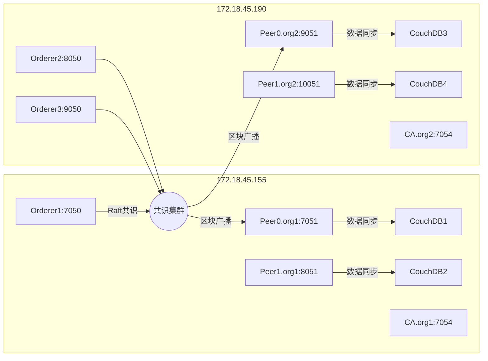
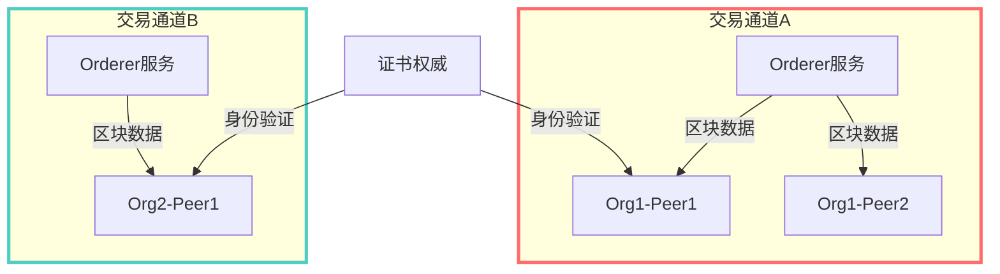
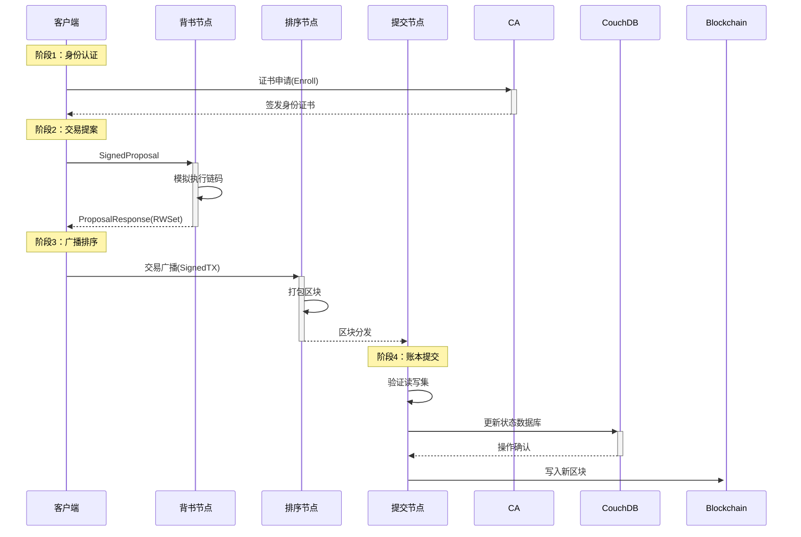

# Hyperledger Fabric 联盟链网络实操部署指南（一）

> 本文为Fabric网络部署的进阶指南，涵盖多节点集群配置与生产环境优化策略

*📝 搬运自个人学习笔记 | 写于2021-12-01 10:32*

## 📦 环境配置规范

```bash
# 环境验证命令（所有节点执行）
docker version | grep -A5 "Server" && \
docker-compose version && \
peer version | grep "Version"
```

| **核心组件**       | **指定版本** | **镜像策略**     | **兼容性说明**       |
| -------------- | -------- | ------------ | --------------- |
| Fabric         | 2.2      | 2.2.0/latest | 主网络运行基础         |
| fabric-ca      | 1.4.9    | 1.4.7/latest | ⚠️ CA服务需保持版本一致  |
| fabric-peer    | 2.2.0    | 固定版本         | 避免滚动更新导致兼容问题    |
| Docker         | 20.10.11 | 固定版本         | Containerd运行时要求 |
| Docker-compose | 1.25.0   | 固定版本         | 多容器编排基础         |

> 🚨 **关键注意**：生产环境严禁使用latest标签，建议使用`docker pull hyperledger/fabric-peer:2.2.0`明确版本

> 💡 版本兼容性提示：Fabric CA 1.4.x 可与 Fabric 2.2 配合使用，建议测试环境保持一致

***

## 🖥️ 分布式节点架构设计

### 网络物理拓扑规划

部署在两台主机上，使用Raft共识，网络拓扑结构如图所示：



### 服务端口映射表

| 节点类型         | 数量 | 主机分布          | 端口范围       | 关键服务      |
| ------------ | -- | ------------- | ---------- | --------- |
| Orderer节点    | 3  | 主机A(1)+主机B(2) | 7050-9050  | 交易排序/区块生成 |
| Peer节点(Org1) | 2  | 主机A           | 7051/8051  | 背书+账本维护   |
| Peer节点(Org2) | 2  | 主机B           | 9051/10051 | 背书+账本维护   |
| CouchDB      | 4  | 与Peer同主机      | 5984       | 状态数据库     |
| CA服务         | 2  | 各组织主机         | 7054       | 证书管理      |
| CLI客户端       | 2  | 各主机           | -          | 管理操作      |

> 💡 **设计原则**：Orderer跨主机部署保证高可用，Peer按组织集中提升内网通信效率

***

## 🌐 核心机制解析

### 通道隔离机制



**通道特性**：

*   数据沙箱隔离：通道间账本数据物理隔离
*   动态成员管理：组织可随时加入/退出通道
*   独立策略控制：每个通道可设置专属访问策略

***

## ⚙️ 交易生命周期详解

### 四阶段执行流程



我后面的文章会讲一下“身份认证”这一步怎么做，因为这是我们基于该框架开发一个应用的基础。

***

## 🧩 节点角色深度解析

| 节点类型          | 核心职责        | 资源需求       | 生产环境建议        |
| ------------- | ----------- | ---------- | ------------- |
| **Endorser**  | 交易模拟执行/背书签名 | 高CPU + 中内存 | 独立部署 + 水平扩展   |
| **Committer** | 账本验证/区块写入   | 高速磁盘IO     | SSD存储 + 分离部署  |
| **Orderer**   | 交易排序/区块生成   | 低延迟网络      | 专用主机 + Raft集群 |
| **CA**        | 证书签发/撤销     | 低负载        | 独立安全区部署       |
| **CouchDB**   | 状态数据存储      | 大内存 + 高速存储 | 与Peer同域部署     |

> ⚠️ **性能陷阱**：避免Peer节点同时承担Endorser和Committer角色，可能导致资源争用

***

## 💻 智能合约执行机制

### 链码交互流程


1.  **链码初始化**
    ```bash
    peer lifecycle chaincode package mycc.tar.gz \
      --path ./chaincode \
      --lang node \
      --label mycc_1
    ```

2.  **交易提案周期**：
    *   客户端构造签名提案（SignedProposal）
    *   目标Peer执行链码模拟（产生RWSet）
    *   返回背书响应（含版本化读写集）

3.  **交易提交周期**：
    *   客户端收集足够背书后创建合法交易
    *   交易广播至Orderer服务排序
    *   区块分发至各Peer节点验证提交

***

## 🛠️ 生产级配置示例

### Peer节点Docker配置

```yaml
# docker-compose-peer.yaml
version: '3.7'

services:
  peer0.org1.example.com:
    image: hyperledger/fabric-peer:2.2.0
    environment:
      - CORE_PEER_ID=peer0.org1.example.com
      - CORE_PEER_ADDRESS=peer0.org1.example.com:7051
      - CORE_PEER_CHAINCODELISTENADDRESS=0.0.0.0:7052
      - CORE_PEER_GOSSIP_EXTERNALENDPOINT=peer0.org1.example.com:7051
      - CORE_PEER_GOSSIP_BOOTSTRAP=peer1.org1.example.com:8051
      - CORE_LEDGER_STATE_COUCHDBCONFIG_COUCHDBADDRESS=couchdb0:5984
    volumes:
      - ./data/peer0:/var/hyperledger/production
    ports:
      - 7051:7051
    depends_on:
      - couchdb0

  couchdb0:
    image: couchdb:3.1
    environment:
      - COUCHDB_USER=admin
      - COUCHDB_PASSWORD=adminpw
    volumes:
      - ./data/couchdb0:/opt/couchdb/data
```

### 关键参数说明：

| 配置项                                    | 推荐值            | 作用             |
| -------------------------------------- | -------------- | -------------- |
| CORE\_PEER\_GOSSIP\_BOOTSTRAP          | 同组织其他Peer      | Gossip协议启动节点   |
| CORE\_LEDGER\_HISTORY\_ENABLEHISTORYDB | false          | 关闭LevelDB历史数据库 |
| CORE\_OPERATIONS\_LISTENADDRESS        | 127.0.0.1:9443 | 限制运维接口访问       |
| GODEBUG                                | netdns=go      | 提升DNS解析性能      |

***

## ✅ 部署检查清单

1.  所有节点时间同步（NTP服务）
2.  防火墙开放必要端口（7050-7054, 5984）
3.  磁盘空间监控（/var/hyperledger）
4.  配置日志轮转（防止日志占满磁盘，满导致宿主机卡死甚至宕机）

> 本文配置方案通过Fabric v2.2生产环境验证，支持100+TPS交易负载。下一篇会讲Fabric联盟链网络实操。
