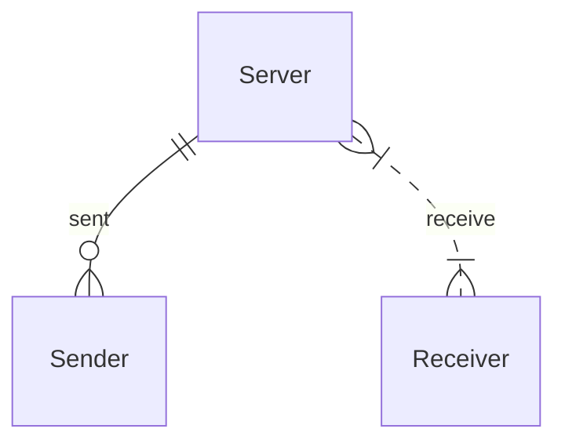

# nodejs+socket.io实现p2p消息实时发送

> 写的较为匆忙，个人知识也较为浅薄，错误之处，期待您的指正

消息实时发送的目的，是完成类似于消息通知、实时聊天等功能。当然，实现效果其实并不是严格意义的 P2P，而是像下面这张图：



发送方Sender把消息发送到了中间服务器，中间服务器在传递给接收方Receiver。但是实现了这种，我相信其实你也能会真的实现P2P。

## 常见的消息通知:

常见的站内通知类别（括号里是对自己目前项目出现情况的分析，读者忽略）：

-   公告 Announcement （通道加入新的组织、某组织或用户新上传了某数据摘要、系统凌晨需要版本更新等事件）
-   提醒 Remind（用户之间、系统与用户之间）
       - 资源订阅提醒（关注的数据摘要更新了内容、评论等）
       - 资源发布提醒（我发布的数据摘要被评论了，被关注了，被申请交易了）
       - 系统提醒
-   私信 Mailbox（类似聊天室吧，暂时没有这需求）

## 实现思路与步骤等
<p>除了用消息队列MQ以外，笔者想到的是使用websocket协议实现，该协议为全双工通信full-duplex，长连接PersistentConnection，相比http来说是种持久化协议。</p>

其中主要的开发步骤有：
- 绑定连接(用户账号和websocket之间的连接)
- 管理连接
- 收发消息(数据格式和读取等具体实现)。

其中，需要注意的点有：
- 长连接的心跳激活处理；
- 服务端调优实现高并发量client同时在线（单机服务器可以实现百万并发长连接）；
- 群发消息；
- 服务端维持多用户的状态；
- 从WebSocket中获取HttpSession进行用户相关操作等

具体实现思路：
1. 前端使用WebSocket与服务端创建连接的时候，将用户ID传给服务端，服务端将用户ID与channel关联起来存储，同时将channel放入到channel组中。（这里的channel就是服务器与客户端之间的连接）
2. 如果需要给所有用户发送消息，直接执行channel组的writeAndFlush()方法；
3. 如果需要给指定用户发送消息，根据用户ID查询到对应的channel,然后执行writeAndFlush()方法；
4. 前端获取到服务端推送的消息之后，将消息内容展示到文本域中。

## 其他方法介绍

**轮询**：客户端定时向服务器发送Ajax请求，服务器接到请求后马上返回响应信息并关闭连接。 优点：后端程序编写比较容易。 缺点：请求中有大半是无用，浪费带宽和服务器资源。 实例：适于小型应用。

**长轮询**：客户端向服务器发送Ajax请求，服务器接到请求后hold住连接，直到有新消息才返回响应信息并关闭连接，客户端处理完响应信息后再向服务器发送新的请求。 优点：在无消息的情况下不会频繁的请求，耗费资小。 缺点：服务器hold连接会消耗资源，返回数据顺序无保证，难于管理维护。 Comet异步的ashx， 实例：WebQQ、Hi网页版、Facebook IM。

**长连接**：在页面里嵌入一个隐蔵iframe，将这个隐蔵iframe的src属性设为对一个长连接的请求或是采用xhr请求，服务器端就能源源不断地往客户端输入数据。 优点：消息即时到达，不发无用请求；管理起来也相对便。 缺点：服务器维护一个长连接会增加开销。 实例：Gmail聊天

**Flash Socket**：在页面中内嵌入一个使用了Socket类的 Flash 程序JavaScript通过调用此Flash程序提供的Socket接口与服务器端的Socket接口进行通信，JavaScript在收到服务器端传送的信息后控制页面的显示。 优点：实现真正的即时通信，而不是伪即时。 缺点：客户端必须安装Flash插件；非HTTP协议，无法自动穿越防火墙。 实例：网络互动游戏。

## 技术实现与相关包介绍
### 包介绍
<p>nodejs不像其他的服务器，对于不同的连接，不支持进程和线程操作，写这类功能的时候就需要找更合适的包。</p>
<p>使用WebSocket协议的包有好多，这里我先讲一种常用的包是nodejs-websocket包，网评说使用较为繁琐，这里就没使用。它需要依赖于底层的C++,Python的环境，支持以node做客户端的访问。当然了，这里我一定要说一下，nodejs-websocket是纯粹的使用了WebSocket协议，因此使用时需要写心跳检测，检测用户是否在线等情况。</p>
<p>我采用的是socket.io，它使用起来较为简单，功能强大，支持集成websocket服务器端和Express3框架与一身。它可以不需要心跳检测，不过这也是个相对说法，因为它结合封装了轮询机制和实时通信，当websocket连接断掉时，它会不停的尝试连接，耗费资源。当然了，还有其他库，比如node-websocket-server（不需要了解，直接放弃）。</p>

### 技术实现
在实现前，考虑到发送消息时，向指定用户发送WebSocket消息，但对方可能不在线，这种情况，我这么处理：
-   如果接收者在线，则存储进redis并实时发送消息；
-   否则将消息存储到redis，等用户登陆上线后主动推送未读消息。

socket.io的客户端和服务端都有两个函数 on()、emit()，核心函数，可轻松实现客户端与服务端的双向通信。
-   emit：触发一个事件，第一个参数是事件名称，第二个参数是要发送到另一端的数据，第三个参数是一个回调函数用来确认对方的接收信息（也可以说时回执），可忽略。
    - socket.emit 信息传输对象为当前 socket 对应的 client ，各个client socket 相互不影响。
    - socket.broadcast.emit 信息传输对象为所有 client ，排除当前socket 对应的 client。
    - io.sockets.emit信息传输对象为所有 client。
-   on：注册一个事件，用来监听 emit 触发的事件。

#### 服务端
直接上代码：

```js
    'use strict';

    // 维护socket连接的代码
    const { addSocketId, getSocketId, deleteSocketId } = require('../../../utils/socket/socketId');
    // 保存消息
    const message = require('../saveMessage');
    // socket连接许可验证
    const { socketAuth } = require('../../../middleware/socket/index')

    // socket接口，传入/bin/www.js
    function init(io) {
    
    /**
     * @description: 为每个传入执行的功能Socket，并且接收套接字和可选地将执行延迟到下一个注册的中间件的参数
     */    
    io.use((socket, next) => {
        if (socket.request.headers.cookie) return next();
        next(new Error('Authentication error'));
    });

    io.on('connection', function(socket) {

        /**
         * @description: 用户登录，则保存用户连接的相关信息,并从redis拉取未读消息，推送给该用户
         */        
        socket.on('user_login', function(socketInfo) {       
            if(!socketInfo.userId) {
                // io.sockets.to(socketInfo['socketId']).emit('disconnect', '');
                return;
            }
            // 将用户与socket插入数据库中
            addSocketId(socketInfo);  
                      
            if (process.env.NODE_ENV === 'development') {
                displayUserInfo(socketInfo);
            };

            // 推送所有消息
            message.pushMessage(socketInfo['userId']).then(pushData => {
                io.sockets.to(socketInfo['socketId']).emit('push_message', pushData);
            });
        });
    
        /**
         * @description: 发给某用户交易通知（在线实时通知，并存储至redis）
         */        
        socket.on('todo', function(todoData) {    
            // 存入redis
            message.addMessage(todoData);
            // 检测用户是否在线
            message.isOnline(todoData['receiver_id']).then(isOnline => {
                // 用户在线则通信
                if (isOnline == true) {
                    getSocketId(todoData['receiver_id']).then(socketId => {            
                        io.sockets.to(socketId).emit('todo_message', todoData);
                    }); 
                };  
            });
        });
    
        // TODO: 需要提醒前端在关闭窗口之前先断开连接（窗口刷新之前应该不需要）
        /**
         * @description: 断开连接
         */        
        socket.on('disconnect', function() {
            // 从数据库中删除连接
            deleteSocketId(socket.id);
            // 判断当前是否是开发环境
            if (process.env.NODE_ENV === 'development') {
                displayUserInfo();
            }
        });
    
    });
    
}

function displayUserInfo(user) {
    console.log(`当前登录用户信息:${user}`);
    return;
}

module.exports = {
    init
};
```
上方代码中，主要创建了connection事件，其下又有user_login、todo、disconnect事件，然后这些事件下又有其创建或监听的事件。
    
user_login事件主要是监听前端用户的登录成功，若用户成功上线，则将redis内的已读未读消息分类后推送给客户端。
    
todo事件则是判断用户在线后，实时传递消息，需要注意使用 io.sockets.to(socketId).emit(eventname, eventdata) 实现P2P消息传送，socketId即为接收消息用户的WebSocket连接的ID。

客户端则需要监听后面emit()参数中的eventname事件。
    
disconnect事件则是在客户端用户登出或刷新页面等认为是断开WebSocket连接时，在维护的socket连接组中删除该用户的WebSocket连接信息。

当然，在连接到connection事件前，有一个中间件io.use((socket, next) => {}，是判断对方的连接是否有效（带有cookie的主动连接）。

然后，在/bin/www .js中引入io：

```js
#!/usr/bin/env node

// 模块依赖
var app = require('../app');
var http = require('http');
const socketIndex = require('../src/routes/socket/index/socket');

// 从环境中取端口，应用到express
var port = normalizePort(process.env.PORT || '3000');
app.set('port', port);

// 创建http服务（将express注册到http中）
server = http.createServer(app);

// 监听
var io = require('socket.io')(server, {
  cors: {
      origin: '*'
  }
  // path: '/socket' // 重新定义socket连接路径
});

// 全局声明
global.io = io;

// socket的程序文件下引入io
socketIndex.init(io);
```
其中，引入函数init()即是上一段代码中的init函数,传入参数即为在服务端入口中创建的io服务。io服务中需要传入cors参数，解决跨域问题，如果想更改websocket连接的地址，则使用path参数，其参数值即是在原先基础的websocket连接地址后加上。

#### 客户端

首先创建一个socket对象，io() 的第一个参数是链接服务器的 URL，默认情况下是 window.location（需要修改成服务端的URL，包括对应的模块或权限对应的指定路径，path参数）。

<p>更不动了，待更！</p>
