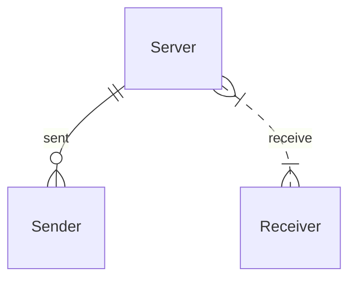

# nodejs+socket.io实现p2p消息实时发送

> 写的较为匆忙，个人知识也较为浅薄，错误之处，期待您的指正

消息实时发送的目的，是完成类似于消息通知、实时聊天等功能。当然，实现效果其实并不是严格意义的 P2P，而是像下面这张图：


```mermaid
erDiagram
Server ||--o{ Sender : sent
Server }|..|{ Receiver : receive
```

发送方 Sender 把消息发送到中间服务器，中间服务器再传递给接收方 Receiver。不过实现了这种"经过服务器中转"的模式，离真正的 P2P 也就不远了。

## 常见的消息通知

常见的站内通知类别（括号里是对自己目前项目出现情况的分析，读者忽略）：

-   公告 Announcement（通道加入新的组织、某组织或用户新上传了某数据摘要、系统凌晨需要版本更新等事件）
-   提醒 Remind（用户之间、系统与用户之间）
       - 资源订阅提醒（关注的数据摘要更新了内容、评论等）
       - 资源发布提醒（我发布的数据摘要被评论了，被关注了，被申请交易了）
       - 系统提醒
-   私信 Mailbox（类似聊天室吧，暂时没有这需求）

## 实现思路与步骤

除了用消息队列 MQ，笔者想到的是用 WebSocket 协议实现，它是全双工通信（full-duplex）的长连接（PersistentConnection），相比 HTTP 来说是种持久化协议。

其中主要的开发步骤有：
- 绑定连接（用户账号和 websocket 之间的连接）
- 管理连接
- 收发消息（数据格式和读取等具体实现）

其中，需要注意的点有：
- 长连接的心跳激活处理；
- 服务端调优实现高并发量 client 同时在线（单机服务器可以实现百万并发长连接）；
- 群发消息；
- 服务端维持多用户的状态；
- 从 WebSocket 中获取 HttpSession 进行用户相关操作等。

具体实现思路：
1. 前端使用 WebSocket 与服务端创建连接的时候，将用户 ID 传给服务端，服务端将用户 ID 与 channel 关联起来存储，同时将 channel 放入到 channel 组中。（这里的 channel 就是服务器与客户端之间的连接）
2. 如果需要给所有用户发送消息，直接执行 channel 组的 writeAndFlush() 方法；
3. 如果需要给指定用户发送消息，根据用户 ID 查询到对应的 channel，然后执行 writeAndFlush() 方法；
4. 前端获取到服务端推送的消息之后，将消息内容展示到文本域中。

## 其他方法介绍

**轮询**：客户端定时向服务器发送 Ajax 请求，服务器接到请求后马上返回响应信息并关闭连接。 优点：后端程序编写比较容易。 缺点：请求中有大半是无用，浪费带宽和服务器资源。 实例：适于小型应用。

**长轮询**：客户端向服务器发送 Ajax 请求，服务器接到请求后 hold 住连接，直到有新消息才返回响应信息并关闭连接，客户端处理完响应信息后再向服务器发送新的请求。 优点：在无消息的情况下不会频繁的请求，耗费资小。 缺点：服务器 hold 连接会消耗资源，返回数据顺序无保证，难于管理维护。 Comet 异步的 ashx， 实例：WebQQ、Hi 网页版、Facebook IM。

**长连接**：在页面里嵌入一个隐蔵 iframe，将这个隐蔵 iframe 的 src 属性设为对一个长连接的请求或是采用 xhr 请求，服务器端就能源源不断地往客户端输入数据。 优点：消息即时到达，不发无用请求；管理起来也相对便。 缺点：服务器维护一个长连接会增加开销。 实例：Gmail 聊天

**Flash Socket**：在页面中内嵌入一个使用了 Socket 类的 Flash 程序，JavaScript 通过调用此 Flash 程序提供的 Socket 接口与服务器端的 Socket 接口进行通信，JavaScript 在收到服务器端传送的信息后控制页面的显示。 优点：实现真正的即时通信，而不是伪即时。 缺点：客户端必须安装 Flash 插件；非 HTTP 协议，无法自动穿越防火墙。 实例：网络互动游戏。

## 技术实现与相关包介绍
### 包介绍

nodejs 不像其他的服务器，对于不同的连接，不支持进程和线程操作，写这类功能的时候就需要找更合适的包。

使用 WebSocket 协议的包有好多，这里先讲一种常用的包是 nodejs-websocket 包，网评说使用较为繁琐，这里就没使用。它需要依赖于底层的 C++、Python 的环境，支持以 node 做客户端的访问。当然了，这里我一定要说一下，nodejs-websocket 是纯粹的使用了 WebSocket 协议，因此使用时需要写心跳检测，检测用户是否在线等情况。

我采用的是 socket.io，它使用起来较为简单，功能强大，支持集成 websocket 服务器端和 Express3 框架于一身。它可以不需要心跳检测，不过这也是个相对说法，因为它结合封装了轮询机制和实时通信，当 websocket 连接断掉时，它会不停的尝试连接，耗费资源。当然了，还有其他库，比如 node-websocket-server（不需要了解，直接放弃）。

### 技术实现
在实现前，考虑到发送消息时，向指定用户发送 WebSocket 消息，但对方可能不在线，这种情况，我这么处理：
-   如果接收者在线，则存储进 redis 并实时发送消息；
-   否则将消息存储到 redis，等用户登陆上线后主动推送未读消息。

socket.io 的客户端和服务端都有两个函数 on()、emit()，核心函数，可轻松实现客户端与服务端的双向通信。
-   emit：触发一个事件，第一个参数是事件名称，第二个参数是要发送到另一端的数据，第三个参数是一个回调函数用来确认对方的接收信息（也可以说是回执），可忽略。
    - socket.emit 信息传输对象为当前 socket 对应的 client，各个 client socket 相互不影响。
    - socket.broadcast.emit 信息传输对象为所有 client，排除当前 socket 对应的 client。
    - io.sockets.emit 信息传输对象为所有 client。
-   on：注册一个事件，用来监听 emit 触发的事件。

#### 服务端
直接上代码：

```js
    'use strict';

    // 维护socket连接的代码
    const { addSocketId, getSocketId, deleteSocketId } = require('../../../utils/socket/socketId');
    // 保存消息
    const message = require('../saveMessage');
    // socket连接许可验证
    const { socketAuth } = require('../../../middleware/socket/index')

    // socket接口，传入/bin/www.js
    function init(io) {
    
    /**
     * @description: 为每个传入执行的功能Socket，并且接收套接字和可选地将执行延迟到下一个注册的中间件的参数
     */    
    io.use((socket, next) => {
        if (socket.request.headers.cookie) return next();
        next(new Error('Authentication error'));
    });

    io.on('connection', function(socket) {

        /**
         * @description: 用户登录，则保存用户连接的相关信息,并从redis拉取未读消息，推送给该用户
         */        
        socket.on('user_login', function(socketInfo) {       
            if(!socketInfo.userId) {
                // io.sockets.to(socketInfo['socketId']).emit('disconnect', '');
                return;
            }
            // 将用户与socket插入数据库中
            addSocketId(socketInfo);  
                      
            if (process.env.NODE_ENV === 'development') {
                displayUserInfo(socketInfo);
            };

            // 推送所有消息
            message.pushMessage(socketInfo['userId']).then(pushData => {
                io.sockets.to(socketInfo['socketId']).emit('push_message', pushData);
            });
        });
    
        /**
         * @description: 发给某用户交易通知（在线实时通知，并存储至redis）
         */        
        socket.on('todo', function(todoData) {    
            // 存入redis
            message.addMessage(todoData);
            // 检测用户是否在线
            message.isOnline(todoData['receiver_id']).then(isOnline => {
                // 用户在线则通信
                if (isOnline == true) {
                    getSocketId(todoData['receiver_id']).then(socketId => {            
                        io.sockets.to(socketId).emit('todo_message', todoData);
                    }); 
                };  
            });
        });
    
        // TODO: 需要提醒前端在关闭窗口之前先断开连接（窗口刷新之前应该不需要）
        /**
         * @description: 断开连接
         */        
        socket.on('disconnect', function() {
            // 从数据库中删除连接
            deleteSocketId(socket.id);
            // 判断当前是否是开发环境
            if (process.env.NODE_ENV === 'development') {
                displayUserInfo();
            }
        });
    
    });
    
}

function displayUserInfo(user) {
    console.log(`当前登录用户信息:${user}`);
    return;
}

module.exports = {
    init
};
```
上方代码中，主要创建了 connection 事件，其下又有 user_login、todo、disconnect 事件，然后这些事件下又有其创建或监听的事件。
    
user_login 事件主要是监听前端用户的登录成功，若用户成功上线，则将 redis 内的已读未读消息分类后推送给客户端。
    
todo 事件则是判断用户在线后，实时传递消息，需要注意使用 `io.sockets.to(socketId).emit(eventname, eventdata)` 实现 P2P 消息传送，socketId 即为接收消息用户的 WebSocket 连接的 ID。

客户端则需要监听后面 emit() 参数中的 eventname 事件。
    
disconnect 事件则是在客户端用户登出或刷新页面等认为是断开 WebSocket 连接时，在维护的 socket 连接组中删除该用户的 WebSocket 连接信息。

当然，在连接到 connection 事件前，有一个中间件 `io.use((socket, next) => {})`，是判断对方的连接是否有效（带有 cookie 的主动连接）。

然后，在/bin/www.js 中引入 io：

```js
#!/usr/bin/env node

// 模块依赖
var app = require('../app');
var http = require('http');
const socketIndex = require('../src/routes/socket/index/socket');

// 从环境中取端口，应用到express
var port = normalizePort(process.env.PORT || '3000');
app.set('port', port);

// 创建http服务（将express注册到http中）
server = http.createServer(app);

// 监听
var io = require('socket.io')(server, {
  cors: {
      origin: '*'
  }
  // path: '/socket' // 重新定义socket连接路径
});

// 全局声明
global.io = io;

// socket的程序文件下引入io
socketIndex.init(io);
```
其中，引入函数 init() 即是上一段代码中的 init 函数，传入参数即为在服务端入口中创建的 io 服务。io 服务中需要传入 cors 参数，解决跨域问题，如果想更改 websocket 连接的地址，则使用 path 参数，其参数值即是在原先基础的 websocket 连接地址后加上。

#### 客户端

客户端接入很简单，先装 `socket.io-client`，然后创建连接、监听事件、发送消息：

```js
import { io } from 'socket.io-client';

// 第一个参数是服务端地址，默认 window.location；transports 指定传输方式
const socket = io('https://example.com', {
  transports: ['websocket'], // 跳过轮询直接上 websocket，也可让它自动协商
  auth: { token: getToken() } // 鉴权信息，服务端在 io.use 里能拿到
});

// 监听连接成功
socket.on('connect', () => {
  console.log('已连接，socketId:', socket.id);
  // 通知服务端当前用户上线，对应服务端的 user_login 事件
  socket.emit('user_login', { userId: 123, socketId: socket.id });
});

// 接收服务端推送的消息（对应服务端 emit 的事件名）
socket.on('push_message', (data) => {
  renderMessageList(data);
});

socket.on('todo_message', (todoData) => {
  showTodoNotification(todoData);
});

// 主动发消息给指定用户（经服务端转发）
socket.emit('todo', {
  receiver_id: 456,
  content: '你有一条新通知'
});

// 断开连接
socket.on('disconnect', (reason) => {
  console.log('断开连接:', reason);
});

// 退出前手动断开
window.addEventListener('beforeunload', () => socket.disconnect());
```

注意客户端监听的事件名，要和服务端 `emit` 的第一个参数对上--服务端 `io.sockets.to(socketId).emit('todo_message', ...)`，客户端就得 `socket.on('todo_message', ...)`。这是双方通信的"暗号"，对不上就收不到。

## rooms 与 namespaces

单机直接用 socketId 点对点发没问题，但遇到"给一个群组广播""按业务模块隔离连接"这类需求，就得用 rooms 和 namespaces。

**namespace** 是连接层面的隔离，相当于在一个端口上开多个独立的通道。比如默认是 `/`，聊天用 `/chat`，通知用 `/notice`，各自独立的连接和事件，互不干扰。

```js
// 服务端
const chat = io.of('/chat');
chat.on('connection', (socket) => { /* ... */ });

// 客户端
const socket = io('/chat');
```

**room** 是 connection 之上的分组，一个 socket 可以同时进多个 room。群里所有人加进同一个 room，广播时按 room 发，不用自己维护 socketId 列表。

```js
socket.on('join_room', (roomId) => {
  socket.join(roomId); // 加入房间
});

// 给房间内所有人发（含自己）
io.to(roomId).emit('new_message', msg);
// 给房间内除了自己以外的人发
socket.to(roomId).emit('new_message', msg);
```

实战上，私聊可以用 room 也可以用 socketId 直接 `to(socketId)`，但群聊基本都得靠 room。

## 几种发送方式对比

socket.io 的发送 API 容易混，列个表对照：

| 写法 | 接收方 |
| --- | --- |
| `socket.emit(event, data)` | 只发给当前这个 socket（自己） |
| `socket.broadcast.emit(event, data)` | 发给除自己外的所有连接 |
| `io.emit(event, data)` | 发给所有连接（含自己） |
| `io.to(room).emit(event, data)` | 发给某房间所有人（含自己） |
| `socket.to(room).emit(event, data)` | 发给某房间除自己以外的人 |
| `io.sockets.to(socketId).emit(event, data)` | 点对点，发给指定 socketId |

记忆窍门：带 `broadcast` 或 `socket.to` 的都不含自己，带 `io.` 的全局发。

## 心跳与断线重连

长连接最怕"假断"--TCP 还在，但实际已经不通了（用户切后台、网络抖动）。socket.io 内置了心跳机制：服务端定期发 ping，客户端回 pong，超时没回就认定断开。相关参数：

```js
const io = require('socket.io')(server, {
  pingInterval: 25000, // 每 25s 发一次 ping
  pingTimeout: 20000,  // 20s 没回 pong 认定断开
});
```

客户端默认开启自动重连，断开后会按退避策略重试。这是 socket.io 比裸 WebSocket 省心的地方--裸 WebSocket 断了你得自己写重连和心跳。但要注意：重连成功后 socket.id 会变，所以业务里别拿 socket.id 当持久标识，要用 userId 关联，连接重建时重新绑定。

## socket.io vs 原生 WebSocket

很多人纠结用哪个，取舍其实挺明确：

| 维度 | socket.io | 原生 WebSocket |
| --- | --- | --- |
| 协议 | 自定义协议（基于 Engine.IO），先轮询探测再升级 | 标准 WebSocket 协议 |
| 兼容 | 不支持 WebSocket 的环境自动降级到轮询 | 不支持就用不了 |
| 心跳/重连 | 内置 | 自己写 |
| 房间/广播/命名空间 | 内置 | 自己实现 |
| 体积 | 客户端较大 | 几乎零成本 |
| 通用性 | 私有协议，两端都得用 socket.io | 标准协议，任何 WS 客户端能连 |

两端都是自己控的项目，用 socket.io 省事；要给第三方标准客户端对接，或追求极简，用原生 WebSocket 加自己补心跳。

## 多实例部署：Redis Adapter

单机够用时前面那套直接能用。但一旦水平扩容到多实例，问题就来了：用户 A 连在实例 1，用户 B 连在实例 2，实例 1 想给 B 发消息，可它根本不知道 B 在哪。socket.io 默认只在自己进程内广播。

解法是加 Adapter，用 Redis 做跨实例的消息总线。每个实例把要广播的消息 publish 到 Redis，所有实例 subscribe 到 Redis，收到后在自己进程内转发：

```js
const { createAdapter } = require('@socket.io/redis-adapter');
const { createClient } = require('redis');

const pubClient = createClient({ url: 'redis://localhost:6379' });
const subClient = pubClient.duplicate();
await Promise.all([pubClient.connect(), subClient.connect()]);

io.adapter(createAdapter(pubClient, subClient));
```

加了 adapter 后，`io.to(room).emit` 这类广播会自动跨实例，业务代码不用改。这是 socket.io 做实时系统最关键的一块生产配置。

## 部署注意：sticky session

如果走 HTTP 长轮询（比如环境不支持 WebSocket），就要求负载均衡器开启 **sticky session**（会话粘滞）--同一个客户端的请求始终打到同一个实例。因为轮询阶段是基于 HTTP 请求的，请求分散到不同实例会导致握手信息丢失。

走纯 WebSocket（`transports: ['websocket']`）则不需要 sticky session，因为建立的是长连接，天然固定在一个实例上。所以生产上能上 WebSocket 就上，省掉 sticky session 这层复杂度。

## 生产避坑

- **别拿 socket.id 当业务标识**：重连后它就变了，用 userId 关联。
- **鉴权放 `io.use` 中间件**：连接建立时就校验 token，别等业务事件再验，晚了。
- **离线消息走存储**：用户不在线时把消息落库（Redis 或 DB），上线主动推未读，别指望 socket.io 帮你存。
- **监控连接数**：单机长连接数受文件句柄限制（`ulimit -n`），百万级要调系统参数、用 cluster 分摊。
- **断开要清理**：`disconnect` 时删掉用户-socket 映射，不然内存里堆一堆僵尸连接。
- **CORS 在创建 io 时配好**：`cors: { origin: '*' }` 只在开发用，生产指定域名。
