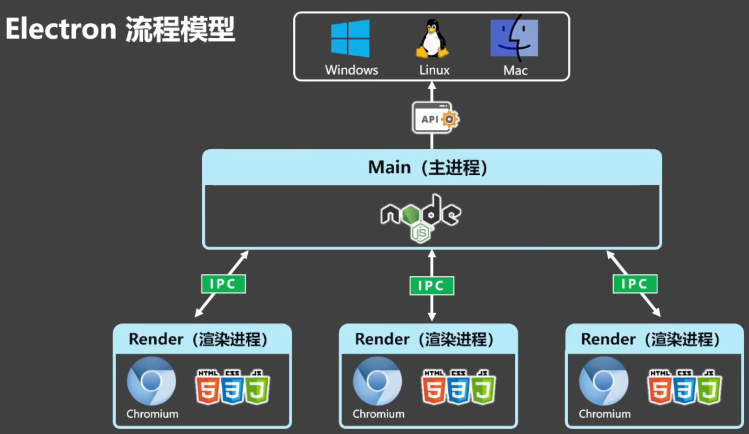

# Electron知识点

跨平台的桌面应用开发框架。Electron 框架出现后，传统桌面应用开发的难点，现在看来也变得异常容易。比如，简单界面绘图可以使用 HTML 的 SVG 或 Canvas 技术实现，简单动效就可以用 CSS Animations 或 Web Animations API 来实现，复杂的动效、图形处理、音视频处理等可以借助 Node.js 的原生 C++ 模块实现。

## 多进程模型

Electron 采用了多进程架构（继承自Chromium），包含 主进程 和 渲染器进程 ，类似于谷歌浏览器的浏览器进程和渲染器进程，避免了使用单个进程处理所有的功能，增加了一定的开销，但是提高了Electron应用的稳定性。

如果使用单一进程，那么可能就会存在渲染任务挂起、窗口崩溃影响整体的等等问题。

每个 Electron 应用都有一个主进程，充当应用的入口点。主进程负责管理应用程序的生命周期、显示原生界面、执行特权操作和管理渲染器进程，包括窗口创建、菜单管理、系统托盘等。

每个 Electron 应用都会为每个打开的 BrowserWindow（以及每个 Web 嵌入）生成一个单独的渲染器进程。渲染进程负责渲染应用程序的界面，包括 HTML、CSS 和 JavaScript。

主进程和渲染进程都是独立的 Node.js 进程，它们之间通过 IPC 通信。

## 主要技术

+ chromium

+ nodejs

+ 原生的api（多系统）

