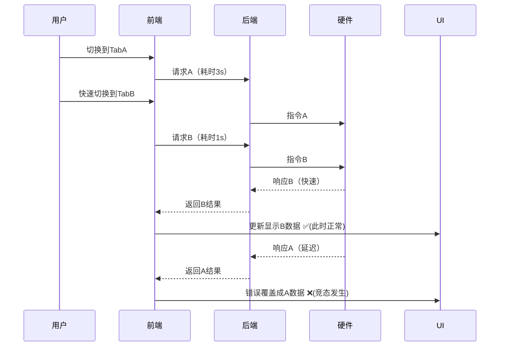

# 记一次交互优化：从根源上解决Axios请求竞态问题

## 前言：一个"诡异"的Bug

故事发生在一个阳光明媚的下午，测试同学突然在群里@我："这个电机参数的弹窗数据好像有问题，有时候会串..."

虽然我立即说出了那句“不应该啊...”，但是凭着直觉，我立刻意识到这可能不是一个简单的Bug。在前端开发中，当"数据错乱"、"状态异常"这类模糊的词语出现时，背后往往隐藏着更深层次的问题。果不其然，经过一番"友好"的交流和复现，我定位到了问题所在。

在一个集成了多个Tab选项卡的弹窗中，每个Tab都会触发一次异步请求来获取详情。当用户以极快的速度（俗称"手速怪"）在Tab间切换时，问题就出现了：

1.  **数据错乱**：Tab2 的请求先回来了，紧接着Tab1的请求也回来了，但因为时序问题，Tab1的响应数据覆盖了本应显示在Tab2上的内容。
2.  **状态"闪烁"**：前一个请求尚未完成，loading状态就被后一个请求意外关闭，导致界面loading状态与实际请求状态不一致。
3.  **内存泄漏警告**：切换过快，组件卸载了，但请求的回调还在尝试更新组件状态，控制台因此报出 `Can't perform state update on unmounted component` 的警告。

这些现象共同指向了一个经典而棘手的问题——**请求竞态（Request Race Condition）**。

## 一、问题还原

让我们用伪代码还原一下最初的案发现场：

```javascript
// 出现问题的接口调用处理部分
const getMotorDetail = async () => {
  try {
    loading.value = true;
    // 就是这个接口啦
    const res = await axios.postAction('/api/motor/params', params);
    // 当快速切换Tab时，后返回的请求会覆盖之前请求的结果
    motorDetailList.value = res.data; 
  } finally {
    // 这个finally块是问题的关键，它无法区分是哪个请求结束了
    // 导致存在这种情况：新Tab的loading被旧请求意外关闭
    loading.value = false; 
  }
}
```

在我们的场景中，每次切换时，不同Tab对应的请求URL和参数虽然完全相同，但由于底层业务涉及硬件设备交互，导致各请求的响应时间存在显著差异（硬件处理时长不一致），请求A的响应耗时就是远大于请求B，从而产生了如下典型竞态流程：



问题的根源在于**HTTP请求的异步性**。我们无法保证请求的响应顺序与它们的发送顺序一致。当用户操作过快，旧的、耗时更长的请求就可能在新的请求完成后才返回结果，从而污染了当前的组件状态。

## 二、方案探索：从"将就"到"讲究"

面对这个问题，我的脑海里闪过了几种方案，这算是一个从"能用"到"好用"的思考过程。

### 方案1：节流（Throttle）- 治标不治本

最容易想到的方法就是请求加一个节流。既然用户操作太快，那就让他"慢"下来。

```javascript
// 用lodash的throttle简单处理
import { throttle } from 'lodash-es';

const getMotorDetail = throttle(async () => {
  // ...请求逻辑
}, 3000, { leading: true, trailing: false });
```

**但这个方案很快被我否决了**

因为不管是这样在请求上或是Tab切换事件上节流，都会存在几个问题：

*   **体验降级**：人为地增加了交互延迟，用户会感觉界面反应太迟钝/存在卡死错觉。
*   **并未根除**：它只是降低了问题发生的概率。如果第一次请求因为网络原因卡了很久（超过500ms），第二次请求依然会发出，竞态问题依然存在。
*   **无法保证顺序**：它不能取消已经发出去的请求，只是阻止了短时间内的新请求。

这是一种"和稀泥"式的解决方案，不能完全解决问题，显然不够优雅。

### 方案2：AbortController - 浏览器的原生答案

接下来，我考虑了W3C推荐的标准方案：`AbortController`。这是专门为取消异步任务（如fetch、xhr）而生的API。

```javascript
// 每次请求前，创建一个新的控制器对象
const controller = new AbortController();

axios.post('/api', params, {
  signal: controller.signal // 获取AbortSignal对象传递给xhr对象
});

// 在组件卸载或发起新请求时，中止上一个
controller.abort();
```

**这个方案的优点很明显**：原生、标准。但结合到我们现有的项目中，问题也不少：

*   **侵入性强**：需要在每个业务组件中手动实例化 `AbortController`，并在合适的时机（如 `onUnmounted` 生命周期钩子）调用 `abort()`。这对于一个比较成型的项目来说，改动成本不小。
*   **封装兼容性**：我们项目中对`axios`有统一的封装，要将`AbortController`的逻辑优雅地集成进去，需要对现有封装做一番"手术"，处理起来比较棘👋。

虽然可行，但感觉有点"杀鸡用牛刀"，不够平滑。

### 方案3：状态标记法 - 简单有效的"土方子"

既然问题的核心是"新旧请求不分"，那我们给每个请求一个唯一的"身份证"不就行了？

```javascript
// 在组件实例中维护一个标识
let activeRequestSymbol = null;

const getMotorDetail = async () => {
  // 为当前请求创建一个唯一ID
  const currentRequestSymbol = Symbol();
  activeRequestSymbol = currentRequestSymbol;
  
  try {
    loading.value = true;
    const res = await axios.postAction(/* ... */);
    
    // 关键检查：只有当前请求的ID与活跃ID匹配时，才更新状态
    if (activeRequestSymbol === currentRequestSymbol) {
      motorDetailList.value = res.data;
    }
  } catch(error) {
     if (activeRequestSymbol === currentRequestSymbol) {
        // 只处理当前活跃请求的错误
     }
  } finally {
    // 同样，只有当活跃请求完成时，才关闭loading
    if (activeRequestSymbol === currentRequestSymbol) {
      loading.value = false;
    }
  }
}
```

这个方案不依赖任何外部API，逻辑清晰，能够精准控制UI状态的更新。它唯一的缺点是需要在每个组件里都写一套类似的逻辑，略显繁琐。

所以：**为什么不把这种"身份识别"和"取消"的能力，直接做到`axios`的封装里去呢？**

## 三、终极方案：打造可配置的请求取消机制

基于我们项目现有的`axios`封装，我决定将"请求标识"和`axios`的`CancelToken`（`AbortController`的旧版API，但在此场景下更易于封装，axios特有实现）结合起来，打造一个既能自动处理重复请求，又可以手动精细控制的通用解决方案。

核心思路是：

1.  为每个"可能需要被取消"的请求生成一个唯一的`key`。
2.  这个`key`可以由开发者自定义（例如，`'你就是我的唯一'`），也可以根据**请求方法 + URL + Params + Data**自动生成。
3.  利用一个`Map`来存储正在进行中的请求及其对应的`cancel`函数。
4.  当一个新请求到来时，检查它的`key`是否存在于`Map`中。如果存在，就调用`cancel`函数中止掉旧的请求，并用新的请求取而代之。

### 1. 增强`utils/request.js`

```javascript
import axios from 'axios';
import { message } from 'ant-design-vue';
import { store } from '@/store';

// 1. 用于存储正在进行中的请求的Map
const pendingRequests = new Map();

// 2. 生成请求唯一标识的核心函数
const generateReqKey = (config) => {
  const { method, url, params, data } = config;
  // 使用&作为分隔符，确保key的唯一性
  return [method, url, JSON.stringify(params), JSON.stringify(data)].join('&');
};

// 3. 将请求添加进pending map
const addPendingRequest = (config) => {
    const requestKey = config.requestKey || generateReqKey(config);
    config.cancelToken = config.cancelToken || new axios.CancelToken((cancel) => {
        if (!pendingRequests.has(requestKey)) {
            pendingRequests.set(requestKey, cancel);
        }
    });
};

// 4. 从pending map中移除请求（并可选择性地取消它）
const removePendingRequest = (config) => {
    const requestKey = config.requestKey || generateReqKey(config);
    if (pendingRequests.has(requestKey)) {
        const cancel = pendingRequests.get(requestKey);
        cancel(requestKey); // 调用cancel函数中止请求
        pendingRequests.delete(requestKey);
    }
};

// ... customAxios 实例创建 ... 这里就不放了啊

// --- 请求拦截器 ---
customAxios.interceptors.request.use(
  (config) => {
    // 如果配置了 requestKey 或 cancelPrevious，则处理重复请求
    // cancelPrevious 是一个更语义化的配置项，表示需要取消之前的同名请求
    if (config?.cancelPrevious) {
      // 删除/取消之前的重复请求
      removePendingRequest(config);
    }
    // 处理新的请求
    addPendingRequest(config);
    // ... 其他请求头处理逻辑 ...
    return config;
  },
  (error) => Promise.reject(error)
);

// --- 响应拦截器 ---
customAxios.interceptors.response.use(
  (response) => {
    // 请求成功，从pending map中移除
    const requestKey = response.config.requestKey || generateReqKey(response.config);
    pendingRequests.delete(requestKey);
    
    // ... 其他响应处理逻辑 ...
    return response.data;
  },
  (error) => {
    // 关键：在这里统一处理错误
    // 1. 如果是主动取消的请求，我们不应该弹出全局错误提示
    if (axios.isCancel(error)) {
      // 可以打印看看 
      console.log('axios.isCancel', error)
      // 直接reject一个特殊标记的对象，让业务代码可以识别到
      return Promise.reject({ isCanceled: true });
    }

    // 2. 对于其他类型的错误，那就从pending中移除
    if (error.config) {
        const requestKey = error.config.requestKey || generateReqKey(error.config);
        pendingRequests.delete(requestKey);
    }
    
    // ... 其他错误处理逻辑，如401跳转登录等 ...
    return Promise.reject(error);
  }
);


const apiAxios = async (
  method,
  url,
  params,
  success,
  failure,
  options = {} // 所有额外配置都从这里传入 包括 requestKey 和 cancelPrevious
) => {
  // 确保options被传递给customAxios实例
  try {
    const responseData = await customAxios({
      method,
      url,
      data: ['POST', 'PUT', 'DELETE'].includes(method.toUpperCase()) ? params : null,
      params: method.toUpperCase() === 'GET' ? params : null,
      ...options, // 将自定义配置（如requestKey, cancelPrevious）透传下去
    });

    // 这里不再需要检查isCanceled，因为取消的请求会直接进入catch块
    if (responseData.code === 200) {
      success && success(responseData);
      return responseData;
    } else {
      failure && failure(responseData);
      return Promise.reject(responseData);
    }
  } catch (error) {
    if (error?.isCanceled) {
      // 静默处理，不执行failure回调，也不向上抛出，中断promise链
      return { isCanceled: true }; // 返回一个标记，让调用方知道是被取消了
    }
    
    // 对于真正的错误
    failure && failure(error);
    // 全局拦截器报错
    message.error(error?.response?.data?.msg || '获取数据时出错');
    throw error; // 仍然向上抛出，让上层业务知道发生了错误
  }
};


export default {
  // ... 其他导出的方法
  postAction: function (url, params, success, failure, options) {
    return apiAxios('POST', url, params, success, failure, options);
  },
  // ...
  isCancel: axios.isCancel, // 这里我直接将isCancel方法暴露出去了，便于业务层判断
};
```

其中，响应拦截器中报错时打印出来的取消异常error，如下：


### 2. 业务组件的优雅实践🌰

经过对axios的封装，我们在业务组件中的调用就会变得更简洁和清晰。

```javascript
// 某业务组件中使用的栗子
import request from '@/utils/request'; // 假设导出的是default对象

const getMotorDetail = async () => {
  // 定义一个唯一的key，用于标识此处的请求
  const requestKey = 'getMotorDetailRequest';
  loading.value = true;
  motorDetailList.value = []; // 先清空旧数据

  try {
    const res = await request.postAction(
      '/api/motor/params/get/params/detail',
      getQueryParams(),
      undefined, // success callback (optional)
      undefined, // failure callback (optional)
      { 
        requestKey,       // 传递自定义key
        cancelPrevious: true // 开启自动取消
      }
    );

    // 请求被取消时，res会是 { isCanceled: true }，不会进入这个if块
    // 也可以用暴露的原方法判断 即!axios.isCancel(res)
    if (!res?.isCanceled && res?.success) {
      loading.value = false
      motorDetailList.value = res.data
    }
    // 如果业务码不为成功，已在apiAxios中统一处理，这里无需关心
  } catch (error) {
    // 真正的网络/服务器错误会在这里被捕获
    // 被取消的请求已经在apiAxios层被处理，不会走到这里
    console.error('获取*****失败:', error);
    loading.value = false
  }
};
```

其中，axios取消请求时返回给业务组件的响应res就是下面这样了：


在`getMotorDetail`的`finally`中设置`loading.value = false;`仍然存在一个微小的竞态可能：如果请求A发出，请求B紧接着发出并取消了A，A的`finally`块理论上仍会执行。因此，没有使用`finally`块对`loading`处理。

由于我们的`apiAxios`对`isCanceled`错误作了静默处理，所以它不会继续向上抛出，使得后续的`catch`逻辑变得更可控。对于绝大多数场景，这样的封装应该已经足够健壮。

## 四、新旧方案对比

| 方案                  | 优点                        | 缺点                | 适用场景                          |
| :------------------ | :------------------------ | :---------------- | :---------------------------- |
| **请求节流**            | 实现简单，开销小                  | 治标不治本，体验差         | 对实时性要求不高的日志上报、用户行为分析等。        |
| **AbortController** | 原生标准，功能强大                 | API略显繁琐，对现有项目有侵入性 | 新项目或需要对请求取消进行非常精细控制的场景。       |
| **组件内状态标记**         | 逻辑清晰，无外部依赖                | 代码冗余，不易维护         | 独立的、临时性的竞态处理需求。               |
| **封装后方案**           | **一劳永逸，代码简洁，可配置性强，无业务侵入** | 需要一次性的封装成本        | **绝大多数需要处理请求竞态的项目，尤其是中后台系统。** |

> 当然了，还可以尝试下“请求标识”和W3C原生标准推荐的AbortController实现，毕竟cancelToken是要被逐步淘汰的。

## 五、实际效果与反思

改造上线后，效果立竿见影：

*   **用户反馈**：测试同学反馈，之前"手速快"时复现的Bug已完全消失，页面交互流畅顺滑。
*   **代码维护**：新增的相关业务代码，只需要在调用`postAction`时多加一个`options`参数，开发心智负担极大降低。

另外，这次看似小小的交互优化，实际上是一次对项目代码质量和开发体验的深度重构，再一次让我感受到：

1.  **直面核心问题**：遇到bug不着急时，不要满足于用"补丁"去掩盖问题，要勇于深入根源，哪怕需要重构。除非屎⛰️量太多了，这种我是真的挣扎不动。
2.  **长远看-封装好事半功倍**：好的封装，能将复杂的逻辑内聚，为业务开发提供简洁、可靠的接口。

> 相信自己不仅仅是修复了一个Bug，更重要的将整个项目的异步交互模型变得更加可靠一些，这对于应用的长期稳定和迭代至关重要。
