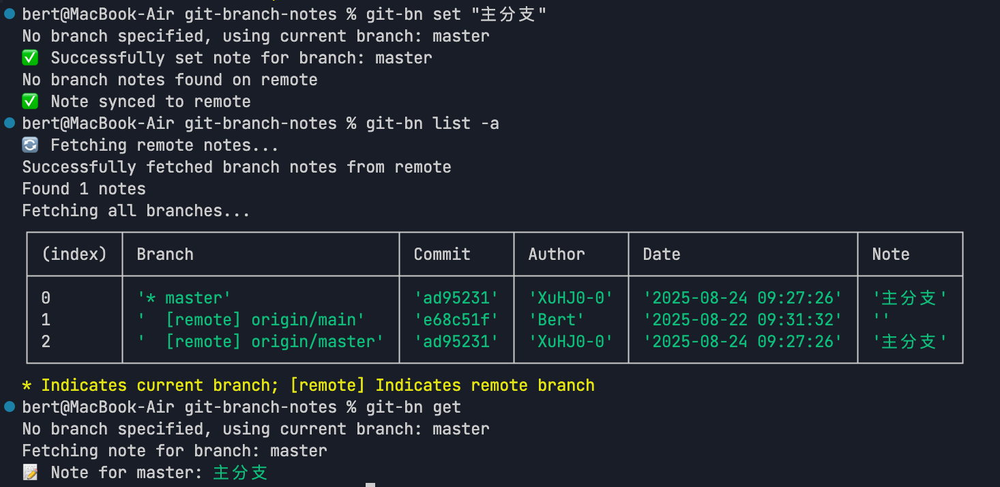

# Git Branch Notes（Git 分支备注工具）

欢迎使用 Git Branch Notes！这是一个用于管理 Git 分支备注并支持远程同步的命令行工具。

[npm包仓库地址](https://www.npmjs.com/package/git-branch-notes)
[代码源地址](https://github.com/BertRepo/git-branch-notes)
> 可以给我点个免费的 star 么？谢谢！

## 安装方式 

```bash
npm install -g git-branch-notes
```
## 使用方法
### 列出所有分支及其备注（包括本地和远程分支）
```bash
git-bn list
git-bn list -a ## 显示所有分支，包括没有备注的分支 --all参数
```
### 只列出远程有备注的分支
```bash
git-bn list -r
git-bn list --remote
```
### 只列出本地有备注的分支
```bash
git-bn list -l
git-bn list --local
```
# 设置备注并同步到远程（默认行为）
```bash
git-bn set "正在开发新功能" ## 为当前分支设置备注
git-bn set -b feature-branch "正在开发新功能"
git-bn set --branch feature-branch "正在开发新功能"
```
如果设置备注时没有指定分支名称，默认会为当前所在分支设置备注。

# 设置备注但不同步到远程
```bash
git-bn set -b feature-branch "正在开发新功能" -n
git-bn set --branch feature-branch "正在开发新功能" --no-sync
```
如果设置备注后没有推送至远程仓库，建议您使用 `git-bn get 分支名称` 命令查看备注。

### 拉取远程备注并推送本地备注至远程仓库，团队其他成员即可获取最新备注信息
```bash
git-bn sync
```
### 获取特定分支的备注
```bash
git-bn get ## 获取当前分支的备注
git-bn get main
```

## 功能特点

+ 📝 为 Git 分支添加备注信息
+ 🔄 跨多个仓库同步备注（手动控制）
+ 🌐 支持远程同步功能
+ 🎯 简单直观的命令行界面

## 示例

