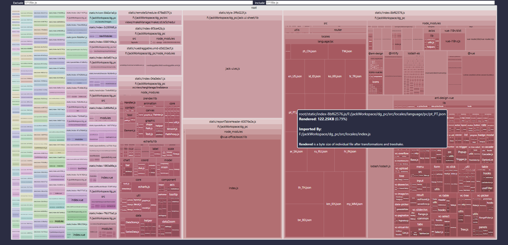

## rollup-plugin-visualizer 的工作原理：从 OutputBundle 到可视化

`rollup-plugin-visualizer` 的本质是一个 Rollup 插件。由于 Vite 的生产构建底层就是 Rollup，所以它在 Vite 项目中可以零适配接入。理解它的原理，关键在于理解它**数据的来源**——Rollup 在 `generateBundle` 钩子里暴露的 `OutputBundle`。

### 钩入 generateBundle，拿到完整产物元数据

Rollup 的插件机制基于钩子（hooks）。这个插件主要使用两个钩子：

- `outputOptions`：拿到输出配置（`dir`、`file`、`entryFileNames` 等），用于决定报告文件落盘位置。
- `generateBundle`：这是关键。它在 Rollup 完成 chunk 拼装、代码渲染（render）之后、文件真正写入磁盘之前触发，签名为 `generateBundle(outputOptions, bundle, isWrite)`，其中 `bundle` 就是 `OutputBundle`——一个以 chunk 文件名为 key、`OutputChunk | OutputAsset` 为 value 的对象。

```ts
// 插件核心逻辑伪代码
import type { Plugin, OutputBundle } from 'rollup'
import { ModuleTree } from './module-tree'

export function visualizer(opts: Options): Plugin {
  return {
    name: 'visualizer',
    // 1. 在 generateBundle 钩子中读取 bundle
    generateBundle(_outputOptions, bundle: OutputBundle) {
      const tree = new ModuleTree()
      for (const [fileName, chunk] of Object.entries(bundle)) {
        if (chunk.type !== 'chunk') continue // 跳过静态资源 asset
        // 2. 遍历 chunk.modules 拿到每个模块的体积指标
        for (const [id, module] of Object.entries(chunk.modules)) {
          tree.addModule({
            id, // 模块绝对路径，如 /node_modules/lodash-es/debounce.js
            renderedLength: module.renderedLength, // 渲染后字节数（tree-shaking 后）
            originalLength: module.originalLength, // 源码字节数
            code: module.code, // 渲染后的代码，用于计算压缩体积
          })
        }
      }
      // 3. 聚合成树 + 渲染 HTML
      const html = renderHtml(tree, opts)
      emitFile(html) // 或写盘
    },
  }
}
```

注意：`chunk.modules` 里的每个模块对象由 Rollup 提供，`renderedLength` 与 `originalLength` 都在此时被填充。这就是可视化报告里每个矩形的"面积来源"。

### 模块体积树的构建与压缩体积计算

拿到 `chunk.modules` 后，插件并不直接平铺展示，而是构建一棵 **模块体积树**：以 npm 包名（从 `node_modules` 路径解析）为中间聚合层，叶子节点是单个模块文件。这样 treemap 上你看到的"lodash-es"大块，其实是其下所有具名模块体积的累加。

至于 `gzipSize` 和 `brotliSize`，插件并不依赖 Rollup 提供的压缩数据，而是自己用 Node 的 `zlib.gzipSync` / 第三方 `brotli` 库对 `module.code` 逐模块压缩计算。这也是为什么开启 `brotliSize` 会让构建稍慢——每个模块都要单独压一次。

### 视图渲染：svelte 包生成 sunburst/treemap/network

报告的交互式 HTML 由一个内嵌的 **svelte** 单页应用生成。插件在构建时把 svelte runtime + 模块体积数据序列化进 HTML，浏览器打开后由 svelte 接管渲染。`template` 参数决定的是 svelte 组件选择：

- `treemap` → 基于 d3-hierarchy 的矩形面积图
- `sunburst` → 基于 d3-partition 的环形分层图
- `network` → 基于 d3-force 的节点-边图（边的来源是模块间的 import 关系）
- `raw-data` → 不渲染图表，直接输出 JSON
- `list` → 平铺表格

理解这一层后，你就能解释一个常见困惑：**为什么报告里的模块体积总和，有时会比磁盘上 chunk 文件大？** 因为 chunk 之间可能共享模块，而 `chunk.modules` 是按"该 chunk 实际包含的模块"统计的，跨 chunk 重复引用时同一模块会在多个 chunk 里各出现一次。读报告要以"单 chunk 视图"为准，跨 chunk 累加要小心重复。

## Rollup chunk 生成机制（深水区）

报告里看到的 chunk 结构，是 Rollup 模块图划分的结果。理解 chunk 怎么来，才能理解报告里为什么会有"共享 chunk"、为什么 `manualChunks` 有时拆得不符合预期。

### 模块图与入口 chunk

Rollup 从入口（`input`）开始，沿 `import` 语句递归解析，构建一张**模块依赖图**（ModuleGraph）。图里每个节点是一个模块，边是 import 关系。构建完成后，Rollup 默认把整张图打成**一个入口 chunk**（除非有动态 import）。

```ts
// rollup.config.ts
export default {
  input: 'src/main.ts', // 单入口 → 默认单 chunk
  output: { dir: 'dist', format: 'es' },
}
```

### 动态 import 触发按需 chunk

当代码里出现 `import()` 动态导入时，Rollup 会把被动态导入的模块及其专属依赖拆成独立的 **按需 chunk**（lazy chunk），只在运行时按需加载。这就是路由懒加载、组件懒加载能在产物层面生效的根因。

```ts
// 静态导入：进入入口 chunk
import { foo } from './foo'
// 动态导入：拆成独立 chunk
const bar = await import('./bar')
```

### 共享 chunk 的自动提取

当**多个入口**同时依赖某个模块，Rollup 会把它提取成共享 chunk，避免在多个入口里重复打包。这一步是 Rollup 自动完成的，不需要你配置。典型的场景是 React/Vue 这类框架核心：多个 HTML 页面入口共享一份 `vendor` chunk。

提取规则可以简化为：**模块被 ≥2 个入口 chunk 引用，且不在动态 import 的路径上 → 提取为共享 chunk**。这也是报告里常出现一个体积可观的、`index` 之外 chunk 的原因。

### manualChunks 的工作机制与坑

`manualChunks` 是 Rollup 提供的手动分包 API，让开发者把指定模块强制归到某个 chunk：

```ts
// vite.config.ts
export default defineConfig({
  build: {
    rollupOptions: {
      output: {
        // 对象写法：key 是 chunk 名，value 是模块 id 数组
        manualChunks: {
          vue: ['vue', 'vue-router', 'pinia'],
          echarts: ['echarts'],
        },
        // 函数写法：更灵活，按 id 动态决定归属
        // manualChunks(id) {
        //   if (id.includes('node_modules')) return 'vendor'
        // },
      },
    },
  },
})
```

工作机制：Rollup 在默认 chunk 划分完成后，再把 `manualChunks` 指定的模块"挪"到对应的 chunk。这里有个**坑**：如果某个被手动归类的模块同时被入口 chunk 同步引用，Rollup 会通过 import 引用关系把两块连起来，但**不会**自动处理循环依赖。当你手动把一个被入口同步引用的核心库塞进 `manualChunks`，可能导致入口 chunk 必须额外发一个请求去取这个 chunk，反而拖慢首屏。

经验法则：`manualChunks` 适合分"稳定且体积大"的依赖（vue、echarts、monaco），利用浏览器长期缓存；不适合分"首屏就要用、又很小"的依赖。

### 循环依赖与 chunk 边界

模块图里若存在循环依赖（A import B，B import A），Rollup 仍能正确打包（通过 hoist 函数声明、live binding 的 `let` 导出），但 chunk 边界遇到循环时需要小心：如果 A 在入口 chunk、B 在按需 chunk，且 A→B→A 形成跨 chunk 循环，Rollup 会在按需 chunk 里放一个 placeholder 引用，运行时通过动态加载回填。这种结构在报告里表现为两个 chunk 互相 import，体积不会重复算，但运行时可能有初始化顺序问题。

## 模块体积指标解读：四个数字分别代表什么

报告里每个模块都挂了四个体积指标，理解它们的差异是定位问题的前提：

| 指标 | 来源 | 含义 | 典型用途 |
| --- | --- | --- | --- |
| `originalLength` | Rollup 模块图 | 模块**源码**字节数（未经任何处理） | 评估源码规模 |
| `renderedLength` | Rollup 渲染阶段 | 模块**实际打包后**字节数（tree-shaking 后） | 产物实际占用 |
| `gzippedSize` | 插件用 zlib 计算 | 对 `renderedLength` 做 gzip 压缩后的字节数 | 估算线上传输体积（HTTP gzip） |
| `brotliSize` | 插件用 brotli 计算 | 对 `renderedLength` 做 brotli 压缩后的字节数 | 估算线上传输体积（HTTPS brotli） |

### renderedLength < originalLength：tree-shaking 生效的证据

这是判断 tree-shaking 是否生效的最直接信号。原理：Rollup 在渲染阶段对每个模块做**死代码消除（DCE）**，只保留被实际引用的导出。如果一个模块 `originalLength = 100KB`，`renderedLength = 5KB`，说明 95KB 的代码被 tree-shake 掉了。

```ts
// lodash-es/debounce.js: originalLength ~5KB, renderedLength ~1KB
// 只 import debounce，其余函数全部被 shake 掉
import { debounce } from 'lodash-es'
```

反过来，如果 `renderedLength ≈ originalLength`，几乎可以判定 tree-shaking **失效**了。常见根因：

- 该模块是 CommonJS（`module.exports`），打包器无法静态分析导出
- 包的 `package.json` 把 `sideEffects` 留空或设错（默认认为有副作用）
- 使用了 `import * as ns` 后又对 `ns` 做动态属性访问
- 导出后再赋值：`export { foo }; foo.bar = ...` 破坏了静态绑定

### gzippedSize vs brotliSize：哪个更接近线上

线上实际传输体积取决于服务器启用的压缩算法。Nginx/CDN 通常同时支持 gzip 与 brotli，浏览器通过 `Accept-Encoding` 协商。一般规律：`brotliSize < gzippedSize < renderedLength`，brotli 对 JS 文本压缩率比 gzip 高 15%~20%。优化决策应该以**线上实际使用的压缩格式**对应的那个数字为准，而不是 `renderedLength`。

## 三种图表的适用场景对比

| 图表 | 数据结构 | 视觉特征 | 最适合的分析场景 |
| --- | --- | --- | --- |
| `treemap` | 层级 + 矩形面积 | 嵌套矩形，面积 ∝ 体积 | **一眼定位体积大户**，快速 Top-N 排查 |
| `sunburst` | 层级 + 同心环 | 同心圆环，弧长 ∝ 体积 | 看包/模块的**层级归属**关系，理解依赖树深度 |
| `network` | 图（节点+边） | 节点 + 连线 | 分析模块间**依赖关系**、找循环依赖、看共享 chunk 引用 |
| `raw-data` | 原始 JSON | 无图形 | CI 卡点、自定义脚本解析、跨构建对比 |
| `list` | 平铺表格 | 行列表格 | 精确查看每个模块四个体积指标，做差量分析 |

<Badge text="提示" type="tip" /> 日常本地分析用 `treemap` 最直观；要追溯依赖关系用 `network`；CI 卡点用 `raw-data`。

## Vite 接入实战

### 安装

```bash
# 推荐用 pnpm
pnpm add -D rollup-plugin-visualizer

# 或 npm / yarn
npm i -D rollup-plugin-visualizer
yarn add -D rollup-plugin-visualizer
```

### 完整 vite.config.ts 配置

```ts
// vite.config.ts
import { defineConfig } from 'vite'
import { visualizer } from 'rollup-plugin-visualizer'

// 用环境变量按需开启，避免污染每次构建
const isAnalyze = process.env.ANALYZE === 'true'

export default defineConfig({
  plugins: [
    // 仅在 ANALYZE=true 时启用，避免 CI 上每次都生成报告
    isAnalyze && visualizer({
      open: true,             // 构建完成后自动用默认浏览器打开报告
      filename: 'stats.html', // 报告输出文件名（相对于产物输出目录）
      template: 'treemap',    // 图表类型：sunburst | treemap | network | raw-data | list
      gzipSize: true,         // 计算并展示 gzip 体积
      brotliSize: true,       // 计算并展示 brotli 体积
      title: 'My Bundle Visualizer', // 报告 HTML 的 title
      emitFile: false,        // true 时写入 Rollup 产物目录（dist），false 写项目根
      projectRoot: process.cwd(), // 项目根，影响模块路径展示
    }),
  ].filter(Boolean), // 过滤掉 false
  build: {
    rollupOptions: {
      output: {
        // 配合 manualChunks 做分包，把稳定的大依赖独立成 chunk
        manualChunks: {
          // vue 全家桶：稳定且首屏必用，独立 chunk 利于浏览器缓存
          vue: ['vue', 'vue-router', 'pinia'],
          // echarts：体积大，但只在图表页用，独立后首屏不带
          echarts: ['echarts'],
          // 通用工具：体积小但多入口共享，独立 chunk 避免重复
          vendor: ['lodash-es', 'dayjs'],
        },
      },
    },
  },
})
```

运行方式：

```bash
# 临时开启分析
ANALYZE=true pnpm build

# 或在 package.json 里加 script
# "analyze": "ANALYZE=true vite build"
```

### 配置项逐项说明

| 参数 | 类型 | 默认值 | 说明 |
| --- | --- | --- | --- |
| `filename` | `string` | `stats.html` | 报告文件名，可放路径如 `../report/stats.html` |
| `template` | `string` | `treemap` | 视图类型，详见上表 |
| `open` | `boolean` | `false` | 是否自动打开浏览器 |
| `gzipSize` | `boolean` | `true` | 计算并展示 gzip 体积 |
| `brotliSize` | `boolean` | `true` | 计算并展示 brotli 体积 |
| `title` | `string` | `Rollup Visualizer` | HTML 标题 |
| `emitFile` | `boolean` | `false` | `true` 时写入 Rollup 产物目录 |
| `sourcemap` | `boolean` | `false` | 用 source map 还原原始模块体积（更准但有开销） |
| `projectRoot` | `string` | `process.cwd()` | 项目根，影响模块路径展示 |

<Badge text="注意" type="warning" /> 也可以把插件放进 `build.rollupOptions.plugins`，效果一致；放在顶层 `plugins` 写法更简洁，推荐后者。

## Webpack 对应方案：webpack-bundle-analyzer

Webpack 项目对应方案是 `webpack-bundle-analyzer`。两者的根本差异在**数据来源**：rollup-plugin-visualizer 读的是 Rollup 的 `OutputBundle`（构建内存中的 chunk.modules），webpack-bundle-analyzer 读的是 Webpack 编译完成后输出的 **`stats.json`**——一个包含全部模块、chunk、reason（引用关系）的 JSON 文件。

```js
// webpack.config.js
const { BundleAnalyzerPlugin } = require('webpack-bundle-analyzer')

module.exports = {
  plugins: [
    new BundleAnalyzerPlugin({
      analyzerMode: 'static',      // 生成静态 HTML
      openAnalyzer: false,         // 不自动打开
      reportFilename: 'report.html',
      // 也可以单独输出 stats.json 供别的工具消费
      // statsOptions: { source: false },
    }),
  ],
}
```

两者对比：

| 维度 | rollup-plugin-visualizer | webpack-bundle-analyzer |
| --- | --- | --- |
| 数据来源 | Rollup `OutputBundle`（内存对象） | Webpack `stats.json`（序列化产物） |
| 适用工具链 | Rollup / Vite | Webpack |
| 视图类型 | treemap/sunburst/network/raw-data/list | treemap/sunburst/empty |
| 体积压缩展示 | gzip + brotli | gzip（parsed/source） |
| 原始数据输出 | 支持 `raw-data` JSON | 支持 server 模式静态 JSON |
| 模块粒度 | 渲染后模块（renderedLength） | parsed/source 两种粒度 |

## 解读可视化报告

构建完成后会自动打开 `stats.html`，一份典型的 treemap 报告长这样：



### 怎么看这张图

1. **矩形面积 = 模块 `renderedLength`**。最大的那几块就是"体积大户"，优先处理它们。鼠标悬浮能看到该模块的 `parsed`、`rendered`、`gzip`、`brotli` 四个维度的体积。
2. **颜色/层级 = 包归属**。同一 npm 包的模块聚合到一起，点开能逐层下钻，看清是包里的哪个子模块占了大头。
3. **左侧搜索框**。直接搜包名（如 `lodash`、`moment`），看它被打进了哪些 chunk、占了多少。这是定位"重复依赖"和"误整包引入"的利器。
4. **顶部 chunk 切换**。Vite 默认会按入口/动态导入分包，切到不同 chunk（如 `vendor`、`index`）分别看体积分布。
5. **滚动缩放**。treemap 支持滚轮缩放进入子层级，方便看深层模块。

### 典型可定位的问题

| 报告现象 | 大概率根因 | 后续动作 |
| --- | --- | --- |
| 某包占 40% 面积 | 整包引入 / 没按需 | 查导入方式，改具名/按需 |
| 同名包出现两个版本矩形 | 依赖树版本冲突 | `pnpm overrides` 去重 |
| 工具库 `renderedLength ≈ originalLength` | tree-shaking 失效 | 换 ESM 版 / 配 `sideEffects` |
| 入口 chunk 含路由级组件 | 未做路由懒加载 | 改 `() => import()` |

## 体积问题定位与优化

定位到问题后，对照下表选择优化手段：

| 问题现象 | 根因 | 优化手段 |
| --- | --- | --- |
| 第三方库整体被打入 | 整包 `import _ from 'lodash'` | 改具名导入 / 换 ESM 版 |
| 同一包多版本共存 | 依赖树版本冲突 | `pnpm overrides` 强制统一 |
| 大型库进首屏 | 同步引入 | 动态 `import()` 懒加载 |
| 首屏 chunk 过大 | 分包策略不合理 | `manualChunks` 拆分 |
| 工具库 tree-shaking 失效 | CJS 格式 / `sideEffects` 未声明 | 换 ESM、配 `sideEffects` |
| 引入了没用的依赖 | 历史遗留 | 删除 / 换轻量替代 |

### 1. 整包引入 → 按需引入

这是最高频的体积问题。原理：**具名导入让 tree-shaking 能识别"被引用的导出"**，从而安全删除未引用部分；而默认导入（`import _ from 'lodash'`）在 CJS 语境下等于拿走整个 `module.exports`，打包器不敢删任何属性。

```ts
// ❌ 整包引入：lodash 全量 ~70KB，renderedLength ≈ originalLength
import _ from 'lodash'
_.debounce(fn, 300)

// ✅ 具名导入：tree-shaking 后只留 debounce，renderedLength ~1KB
import { debounce } from 'lodash-es' // 注意是 lodash-es（ESM 版）
debounce(fn, 300)
```

```ts
// ❌ 全量引入 echarts（~1MB）
import * as echarts from 'echarts'

// ✅ 按需引入：只打包用到的图表模块
import * as echarts from 'echarts/core'
import { BarChart } from 'echarts/charts'
import { GridComponent } from 'echarts/components'
import { CanvasRenderer } from 'echarts/renderers'
echarts.use([BarChart, GridComponent, CanvasRenderer])
```

```ts
// ❌ moment.js（带全部 locale，~300KB）
import moment from 'moment'

// ✅ 换成 dayjs（API 几乎兼容，~7KB）
import dayjs from 'dayjs'
```

### 2. Tree-shaking 失效的根因与排查

报告中如果发现某工具库 `renderedLength ≈ originalLength`，几乎可以断定 tree-shaking 失效。三大根因：

**根因一：CommonJS 模块无法静态分析。** CJS 的 `module.exports` 是运行时赋值，打包器无法在编译期确定哪些导出被使用，只能保守全量保留。解法是换 ESM 版本（`lodash` → `lodash-es`，`axios` 找 ESM 入口）。

**根因二：`sideEffects` 配置错误。** 包的 `package.json` 若未声明 `sideEffects`，打包器默认认为"所有导入都有副作用"，不敢删。正确做法是在自己库/项目里声明：

```json
{
  "sideEffects": false
}
```

<Badge text="注意" type="warning" /> 如果项目里有靠副作用生效的代码（如全局 CSS `import './style.css'`、polyfill），要把它们列进白名单，否则会被误删：`"sideEffects": ["*.css", "./src/polyfill.ts"]`。

**根因三：动态属性访问破坏静态绑定。**

```ts
// ❌ ns 动态访问，打包器无法静态分析用了哪个属性
import * as utils from 'utils'
const fn = utils[Math.random() > 0.5 ? 'foo' : 'bar']

// ✅ 具名导入，静态可分析
import { foo, bar } from 'utils'
```

### 3. 重复依赖 / 多版本 → 去重

报告中如果看到同一个包出现两个版本矩形，说明依赖树里有冲突——通常是 A 依赖 `lodash@^4.17.0`，B 依赖 `lodash@^3.10.0`，pnpm 默认会各装一份。用 `pnpm why <pkg>` 查谁依赖了它，再用 `overrides` 强制统一版本：

```json
{
  "pnpm": {
    "overrides": {
      "lodash": "^4.17.21",
      "debug": "^4.3.4"
    }
  }
}
```

去重后报告里该包应该只剩一个版本矩形，体积立刻下降。

### 4. 分包策略：manualChunks 把大依赖独立成 chunk

把稳定且体积大的依赖独立成 chunk，可以利用浏览器长期缓存：业务代码频繁变动，但 vue/echarts 这类依赖版本稳定，独立 chunk 后用户二次访问只需重新下载业务 chunk。

```ts
// vite.config.ts
export default defineConfig({
  build: {
    rollupOptions: {
      output: {
        manualChunks: {
          // 稳定且首屏必用 → 独立 chunk
          vue: ['vue', 'vue-router', 'pinia'],
          // 体积大但非首屏 → 独立 chunk，首屏不带
          echarts: ['echarts'],
          // 多入口共享 → 独立 chunk 避免重复
          vendor: ['lodash-es', 'dayjs'],
        },
      },
    },
  },
})
```

注意前面提到的坑：不要把首屏就要用、又很小的依赖塞进 `manualChunks`，否则入口 chunk 反而要额外发请求取它。

### 5. 大型库懒加载

把不紧急的库改成动态导入，挪出首屏 chunk：

```ts
// 路由级懒加载
const Editor = () => import('@/components/Editor.vue')

// 业务代码里按需懒加载
async function openPdf() {
  const { default: pdfjs } = await import('pdfjs-dist')
  // ...
}
```

懒加载后，对应模块会从入口 chunk 消失，转而出现在按需 chunk 里。

### 6. 删除无用依赖 / 换轻量替代

报告中那些"看着眼生"的包，多半是历史遗留。用 `depcheck` 扫一遍未使用的依赖：

```bash
npx depcheck
```

常见的轻量替代清单：

| 重依赖 | 轻替代 | 体积降幅 |
| --- | --- | --- |
| `moment` | `dayjs` | ~300KB → ~7KB |
| `lodash` | `lodash-es` / `es-toolkit` | 按需 ~70KB → ~1KB |
| `request` | `axios` / `fetch` | 已废弃 |
| `uuid` | `nanoid` | ~3KB → ~0.1KB |

## 进阶：压缩、source map、CI 防回归

### gzip vs brotli：压缩率与浏览器支持

| 压缩格式 | 压缩率 | 浏览器支持 | 协议要求 |
| --- | --- | --- | --- |
| gzip | 基准（100%） | 全部（含 HTTP/1.1） | 无 |
| brotli | 比 gzip 高 15%~20% | 现代浏览器（Chrome/Edge/Firefox/Safari） | **仅 HTTPS** |

生产环境如果走 Nginx/CDN，建议优先开启 Brotli：

```nginx
# nginx.conf
brotli on;
brotli_types text/css application/javascript application/json;
brotli_comp_level 6;
```

注意 brotli 仅在 HTTPS 下生效，HTTP/1.1 会降级为 gzip。优化决策要以**线上实际传输的压缩体积**为准——如果 CDN 只开了 gzip，那 `brotliSize` 再小也不是用户真实体验。

### source map 模式：还原原始模块体积

开 `sourcemap: true` 时，插件会用 source map 把压缩合并后的代码体积**还原回原始模块**，定位更准——能看清是哪个源文件贡献的体积，而不是合并后的 chunk 视图。代价是构建变慢（要解析 source map），仅本地分析时开启。

### CI 中集成体积监控与阈值告警

优化的最大敌人是"回归"——这周砍掉 50KB，下周又被一个 PR 悄悄加回来。解决思路是把体积卡点做进 CI。

**方案一：`size-limit`（推荐）**

```bash
pnpm add -D size-limit @size-limit/file
```

```json
// package.json
{
  "size-limit": [
    { "path": "dist/assets/index.js", "limit": "100 KB", "gzip": true },
    { "path": "dist/assets/vendor.js", "limit": "150 KB", "gzip": true }
  ],
  "scripts": {
    "size": "size-limit"
  }
}
```

在 CI 里 `pnpm build && pnpm size`，超限直接让 PR 红灯。

**方案二：`raw-data` JSON + 自定义脚本**

用 `rollup-plugin-visualizer` 输出原始 JSON，自己解析做卡点：

```ts
visualizer({
  template: 'raw-data',
  filename: 'bundle-stats.json',
  emitFile: true,
})
```

然后用脚本读取 JSON、累加各 chunk 体积、与阈值比较、超限 `process.exit(1)`。适合需要按"包名维度"做精细预算的团队。

**方案三：`bundlewatch` / `bundlesize`** 支持 GitHub PR 直接评论体积变化，配合 PR Review 体验更好。

## 小结

打包优化这件事，难点从来不在"怎么改代码"，而在"改哪里收益最大"。`rollup-plugin-visualizer` 给了我们一双能看穿产物内部结构的眼睛——它把"黑盒的 dist"变成"可下钻的地图"，让每一 KB 都有迹可循。

记住一条主线：**可视化是测量手段，先测量再优化**。理解 Rollup 的 chunk 生成与模块体积指标（`renderedLength` / `originalLength` / `gzippedSize` / `brotliSize`），用报告定位前三大体积来源，对照"整包引入 / tree-shaking 失效 / 重复依赖 / 分包策略 / 轻量替代"五把刀逐一拆解，最后用 CI 体积卡点锁住战果、防止回归。当产物体积不再是玄学，性能预算才真正落地。
