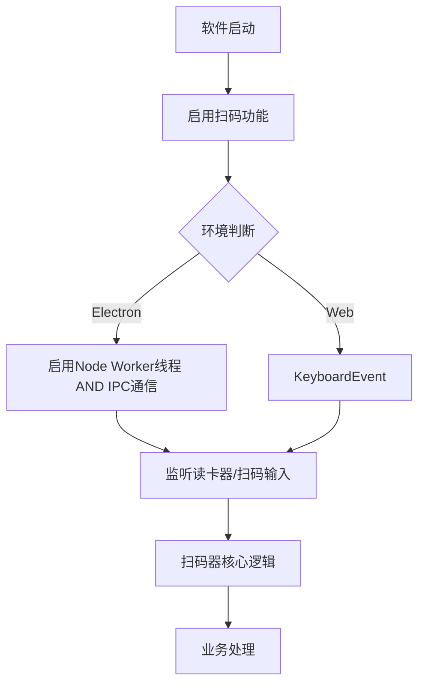
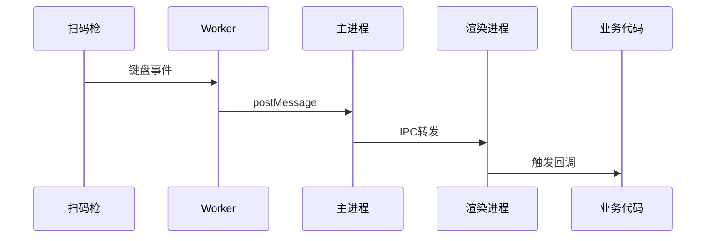
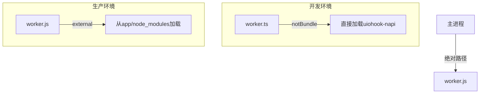

# Electron项目中扫码功能的深度优化：Worker线程与系统级键盘监听实战

> 在工业级应用中实现高效扫码功能，我踩了一些坑，基于Electron+uiohook-napi实现了一套这样的高性能跨平台系统级扫码解决方案。

## 背景与挑战

在开发****行业工厂生产管理系统时，我们需要实现一个**高性能的扫码功能**，用于查询相应信息或执行其他回调。面临的核心挑战包括：

1. **系统级键盘监听**：需要在系统层面捕获USB扫码枪/RFID读卡器输入，而不干扰用户正常键盘操作；
2. **跨平台兼容**：方案需同时支持Electron客户端和Web浏览器环境
3. **性能底线/优化**：扫码处理不能阻塞主进程，避免界面卡顿
4. **打包难题**：uiohook-napi原生模块在Electron中的集成问题
5. **扫码功能可靠**：不能存在漏读、误读等异常情况

## 技术选型与架构设计

### 核心技术栈
- [**uiohook-napi**](https://www.npmjs.com/package/uiohook-napi)：用于捕获系统级键盘事件的Node.js原生模块 
- [**Worker Threads**](https://nodejs.org/download/release/v22.13.0/docs/api/worker_threads.html#worker-threads)：使用Node.js原生Worker线程隔离高密度键盘事件处理，避免阻塞主进程
- **单例模式**：全局扫码器实例管理，确保全局有且仅有一个扫码实例
- **发布订阅模式**：灵活的事件处理机制

### Electron多线程方案对比：worker_threads vs Web Worker

在 Electron 项目中，常见的多线程方案包括：

- **worker_threads**：Node.js 原生模块，支持主进程和渲染进程，能加载原生模块，适合高性能系统级任务。
- **child_process**：Node.js 原生模块，适合进程级隔离和独立脚本执行。
- **Web Worker**：浏览器 API，只能在渲染进程使用，无法直接访问 Node.js API 和原生模块。

> 这里主要对比 worker_threads（Node.js Worker Thread）和 Web Worker 在扫码场景下的适用性。child_process 适合更重型的进程隔离场景，此处不展开。

#### 1. 能力支持对比

| 能力           | Node.js Worker Thread | Web Worker |
|----------------|----------------------------------------|-----------------------------|
| Node.js API    | ✅ 完全支持                             | ❌ 默认不支持                |
| 原生模块       | ✅ 可直接加载（如uiohook-napi）         | ❌ 无法加载                  |
| 平台兼容性     | Electron主进程/渲染进程均可用           | 仅渲染进程可用               |
| 通信方式       | postMessage                             | postMessage                 |
| 安全性         | 需注意Node权限                          | 沙箱环境，较安全             |

#### 2. 性能表现

Node.js Worker Thread 相比于 Web Worker，在CPU占用、内存占用、响应延迟、并发能力方面表现均会更好。

Node.js Worker Thread 属于原生多线程实现，线程之间共享内存（零拷贝），通信和数据传递效率高，且可以直接访问 Node.js 的底层API和原生模块。

Web Worker 的设计初衷是让前端页面能做异步计算，运行在浏览器沙箱环境，和主线程隔离，但是有时候也会依赖于主线程。对于它来说，安全性优先，性能不是首要目标，调度和资源分配也都受限于浏览器实现。它只能访问浏览器提供的 API，不能直接访问 Node.js 的底层能力，数据传递也只能用 postMessage，且数据会被序列化/反序列化，效率相对较低。

#### 3. 适用场景

- **worker_threads（Node.js Worker Thread）**
  - 需要访问系统级硬件（如扫码枪、RFID等）
  - 需要加载原生模块
  - 需要高性能、低延迟、主进程隔离
  - 适合 Electron 主进程/渲染进程的重型任务
  - 任务与主/渲染进程解耦，提升整体稳定性

- **Web Worker（浏览器 Worker）**
  - 仅做前端数据处理、异步计算
  - 不涉及系统API和原生模块
  - 适合纯Web项目或Electron渲染进程的轻量任务
  - 即使通过特殊配置获得 Node 能力，也存在安全隐患，不推荐用于系统级任务

> 注：简单总结下来，worker_threads 可直接处理高频系统级事件，Web Worker 仅适合前端数据处理。

你如果想在Electron中开启Web Worker，就需要开启nodeIntegrationInWorker配置。

在创建 `Electron` 中的 `BrowserWindow` 对象的时候，启用 `webPreferences` 中的配置项。
```js
const win = new BrowserWindow({
    webPreferences: {
        nodeIntegration: true,// 集成node
        contextIsolation: false, // 禁用上下文隔离
        nodeIntegrationInWorker: true // 允许在 Worker 中使用 Node.js API
    }
})
```

> ⚠️ 注意：
> - 另外，在 Electron 渲染进程中通过 nodeIntegration: true 和 contextIsolation: false 虽可让 Web Worker 访问 Node.js API，但存在较大安全风险，生产环境不推荐。存在的风险比如说：任意代码执行、原型污染、Electron API滥用。
> - 但是直接开启contextIsolation的话，这又和nodeIntegration本质上矛盾了。因为上下文隔离环境下，Node API不可用，功能失效。Electron文档中告诉我们，此时Node API可以通过预加载脚本桥接，即contextBridge模块，但也存在安全事项。


#### 4. 两者比较小节

- **扫码等系统级输入监听场景，我觉得强烈推荐使用 worker_threads（Node.js Worker Thread）**，不仅支持原生模块，还能有效隔离主/渲染进程，提升性能与稳定性。
- **Web Worker 适合前端数据处理、异步计算、大文件下载等轻量任务，不适合系统级硬件监听。**

### 整体事务流程



#### 架构简单说明

| 阶段 | 实现方式 | 技术要点 |
|:------|:----------|:----------|
| **初始化阶段** | 单例模式 | 全局唯一扫码器实例<br>懒加载初始化<br>资源统一管理 |
| **环境适配** | 条件判断 + 降级处理 | Electron: Node Worker线程<br>Web: 原生keydown事件<br>trycatch降级机制 |
| **输入处理** | 事件监听 + 分发 | 多设备输入支持<br>统一事件接口<br>事件队列管理 |
| **核心逻辑** | 数据处理 + 规则引擎 | 输入数据验证<br>扫码数据解析<br>业务规则匹配 |
| **业务处理** | 状态管理 + UI更新 | 数据持久化存储<br>状态同步更新<br>界面实时响应 |


## 核心实现解析

> 没有cv出所有代码哦，只放了比较核心的代码，挺全的啦

以下第1，2小节主要就是Electron部分代码，实现流程如下图：



基于这个流程，就能实现我们扫码/读卡需要的系统级特性。不管是缩小化软件窗口还是鼠标在窗口外聚焦，只要软件未关闭（Worker未被释放），就能扫码读卡。

### 1. 主进程中的Worker管理

主进程负责Worker线程的生命周期管理，包括创建、消息转发（至渲染进程）和错误处理，确保扫码功能的稳定运行。在主进程进入关闭状态时，要注意先释放worker线程。

```typescript
// electron/main/index.ts
import path from 'path';
import { Worker } from "node:worker_threads";

// 全局变量保存 Worker 实例
let worker: Worker | null = null;

const runWorkers = () => {
  return new Promise((resolve, reject) => {
  
    const workerPath = path.join(__dirname, 'worker.js');
    worker = new Worker(workerPath);

    worker.on("message", (message) => {
      // 转发到渲染进程
      if (win && win.webContents) {
        win.webContents.send('key-event', message);
      }
    });

    worker.on("error", (error) => {
      logger.error(`Worker error: ${error}`);
      reject(error);
    });

    worker.on("exit", (code) => {
      if (code !== 0) {
        reject(new Error(`Worker exited with code ${code}`));
      } else {
        resolve(null);
      }
    });
  });
};

// 创建主窗口时记得run起来
app.whenReady().then(()=>{
  // 省略其他code啦
  runWorkers()
    .then(() => {
      logger.info('读卡监听正常关闭')
    })
    .catch((error) => {
      logger.info(`读卡监听异常了：${error}`);
    });
  // ......
})

// 应用关闭退出时记得清理
app.on('colse', async () => {
  // 省略其他code啦
  if (worker) {
    try {
      await worker.terminate();
      logger.info('Worker terminated successfully');
    } catch (error) {
      logger.error(`Worker termination error: ${error}`);
    }
    worker = null;
  }
  // ......
});
```

### 2. Worker线程中的键盘监听

Worker线程专注于系统级键盘事件的监听和处理，通过Node.js的Worker Threads机制与主进程通信，主进程再通过IPC将事件转发给渲染进程。

```typescript
// electron/main/worker.ts
import { parentPort } from 'worker_threads';
import { uIOhook, UiohookKey } from 'uiohook-napi';

// 十进制keycode转UiohookKey
function getKeyFromKeycode(keycode: number): string | null {
  const hexKeycode = keycode.toString(16).toUpperCase();
  
  for (const [key, value] of Object.entries(UiohookKey)) {
    if (value.toString(16).toUpperCase() === hexKeycode) {
      return key;
    }
  }
  return null;
}

if (parentPort) {
  uIOhook.on('keydown', (e) => {
    const keyName = getKeyFromKeycode(e.keycode);
    
    parentPort.postMessage({
      ...e,
      keyName,
      type: 'uiohook-keydown'
    });
  });

  uIOhook.start();
} else {
  throw new Error('Worker thread中parentPort异常');
}
```

### 3. 跨平台扫码器核心类

扫码器核心类采用单例模式，实现了跨平台的事件处理和扫码逻辑，支持Electron和Web环境。

在Electron环境下，考虑到需要通信，timeAvgThreshold设置为了50ms。

这里的读卡处理handleKeydown中要注意对输入的处理，刚开始这里没处理好，出现了漏读的情况，导致连续读卡时，页面没读卡响应。

```typescript
// src/utils/CodeScanner.ts
class CodeScanner {
  static _instance: CodeScanner | null = null;
  private input = "";
  private isScannerEnabled = false;
  private startTimestamp = 0;
  private callbacks = new Set<Function>();

  // 不同环境下的超时阈值
  private timeAvgThreshold = 30;

  private constructor() {
    this.initListener();
  }

  static getInstance() {
    if (!CodeScanner._instance) {
      CodeScanner._instance = new CodeScanner();
    }
    return CodeScanner._instance;
  }

  private handleKeydown(event: KeyboardEvent) {
    if (!this.isScannerEnabled) return;

    // 重置检测
    const elapsed = performance.now() - this.startTimestamp;
    const avgTimePerChar =
      this.input.length > 0 ? elapsed / this.input.length : 0;

    if (avgTimePerChar > this.timeAvgThreshold || event.key === "Backspace") {
      this.reset();
    }

    // 处理回车（扫码结束）
    if (event.key === "Enter") {
      if (this.input.length >= 10) {
        this.processBarcode(this.input);
      }
      this.reset();
      return;
    }

    // 过滤功能键
    if (event.key.length > 1 && !/^\d$/.test(event.key)) {
      return;
    }

    // 记录第一个字符的时间戳
    if (!this.startTimestamp) {
      this.startTimestamp = performance.now();
    }

    // 数字字符处理
    if (/^\d$/.test(event.key)) {
      this.input += event.key;
    }
  }

  private reset() {
    this.input = "";
    this.startTimestamp = 0;
  }

  private processBarcode(barcode: string) {
    this.callbacks.forEach((cb) => cb(barcode));
  }

  public enable() {
    if (this.isScannerEnabled) return;
    this.isScannerEnabled = true;
    this.initListener();
  }

  public disable() {
    this.isScannerEnabled = false;
    this.quitListener();
  }
  private addKeyListener() {
    window.addEventListener("keydown", this.boundKeyListener);
  }

  private removeKeyListener() {
    window.removeEventListener("keydown", this.boundKeyListener);
  }

  private boundKeyListener = (event) => {
    this.handleKeydown(event);
  };

  // 初始化监听器（自动判断环境）
  private initListener() {
    if (isH5) {
      this.initWebListener();
    } else {
      this.initElectronListener();
    }
  }

  private initWebListener() {
    this.timeAvgThreshold = 30;
    this.addKeyListener();
  }

  private initElectronListener() {
    try {
      this.timeAvgThreshold = 50;
      //@ts-check
      import("electron").then(({ ipcRenderer }) => {
        ipcRenderer.on("key-event", (_, keyData) => {
          this.boundKeyListener(keyData);
        });
      });
    } catch (err) {
      this.initWebListener(); // 降级处理
    }
  }

  private quitListener() {
    if (isH5) {
      this.quitWebListener();
    } else {
      this.quitElectronListener();
    }
  }

  private quitWebListener() {
    this.removeKeyListener();
  }

  private quitElectronListener() {
    try {
      import("electron").then(({ ipcRenderer }) => {
        ipcRenderer.removeAllListeners("key-event");
      });
    } catch (err) {
      this.quitWebListener(); // 降级处理
    }
  }

  // 公共API
  public on(callback: Function) {
    this.callbacks.add(callback);
  }

  public off(callback: Function) {
    this.callbacks.delete(callback);
  }
}

```

### 4. 业务层统一适配接口

业务层通过自定义Hook封装扫码功能，提供统一的接口和自动清理机制。

```typescript
// src/hooks/useUSBKeyBoard.ts
import CodeScanner from '@/utils/CodeScanner';

export default function useUSBKeyBoard(callback: Function) {
  const scanner = CodeScanner.getInstance();
  
  // 启用扫码器 (可以不执行，其实实例创建的时候，已经通过构造函数开启扫码器了)
  scanner.enable();
  
  const handler = (barcode: string) => {
    callback(barcode);
  };
  
  scanner.on(handler);
  
  // 返回清理函数
  return () => {
    scanner.off(handler);
    scanner.disable();
  };
}
```

## Worker线程的两种实现模式对比

以上实现的扫码功能中，我使用的是文件模式，这是我踩过坑之后做出来的。

我刚开始在Worker线程中尝试了字符串模式，发现存在问题，下面进行详细分析。

### 字符串模式实现

```typescript
const script = `
  const { parentPort } = require('worker_threads');
  const { uIOhook, UiohookKey } = require('uiohook-napi');
  
  // 键盘事件处理逻辑
  function getKeyFromKeycode(keycode) {
    const hexKeycode = keycode.toString(16).toUpperCase();
    for (const [key, value] of Object.entries(UiohookKey)) {
      if (value.toString(16).toUpperCase() === hexKeycode) {
        return key;
      }
    }
    return null;
  }

  uIOhook.on('keydown', (e) => {
    const keyName = getKeyFromKeycode(e.keycode);
    parentPort.postMessage({
      ...e,
      keyName,
      type: 'uiohook-keydown'
    });
  });
  
  uIOhook.start();
`;

// 创建Worker实例
worker = new Worker(script, { eval: true });
```

这样，代码内联，不需要额外的文件管理，很适合简单的Worker逻辑。

但是！！！
打包exe，安装测试后，发现日志中存在原生模块（uiohook-napi）的引用问题。

## 打包问题深度分析

### 1. uiohook-napi模块打包问题

日志中暴露的uiohook-napi模块的打包问题。具体表现为：

1. 打包后的应用无法找到uiohook-napi模块
2. 日志中显示模块加载错误
3. Worker线程启动失败

通过分析，我们发现问题的根源在于：

-   **字符串模式**下：

    -   Node.js 会将脚本视为**独立执行环境**
    -   无法正确找到原生模块的二进制文件（`.node`文件）

-   **文件模式**下：

    -   遵循正常的模块解析规则
    -   能正确定位到 `node_modules/uiohook-napi` 的二进制文件

我们都知道，原生模块加载原理如下图所示：

而字符串模式断裂点就是在 查找.node文件阶段。

那么我们修改成文件模式后，打包测试发现仍然没有成功，修改asar配置项，查看打包出来的文件，发现resource下有着uiohook-napi包。在这个一系列的过程中，我们发现了如下几个问题：

1. **模块依赖关系**：uiohook-napi是C++编写的原生模块，需要正确配置打包工具。他需要编译成平台特定的二进制文件，不能直接通过Vite的默认打包流程处理。
2. **Worker执行环境**：Worker线程中`require()` 的模块解析路径与主进程不同，她基于的是 Worker 初始化时的 `__dirname`（通常是打包后的临时目录）
3. **打包配置问题**：Vite默认会将所有依赖打包成ES模块，而uiohook-napi原生模块需要保持CommonJS格式，直接打包会导致模块加载失败。

### 2. 解决方案

#### 2.1 Vite配置修改

```typescript
// vite.config.ts
export default defineConfig({
  plugins: [
    electron({
      entry: 'electron/main/index.ts',
      vite: {
        build: {
          rollupOptions: {
            external: ['uiohook-napi'],
            input: {
              index: path.resolve(__dirname, 'electron/main/index.ts'),
              // 相当于有两个入口，但是直接存在dist-electron文件夹下 然后使用绝对路径没有问题
              worker: path.resolve(__dirname, 'electron/main/worker.ts')
            }
          }
        },
        plugins: [
          isServe && notBundle({
            filter: ['electron-log', 'uiohook-napi']
          })
        ]
      }
    })
  ]
});
```

通过配置**external**将原生模块排除在Rollup打包流程外，配合**notBundle插件**在开发环境下绕过Vite的模块转换，确保uiohook-napi始终以CommonJS格式加载。同时通过多入口配置将Worker文件独立编译，最终形成：

1.  **开发环境**：`notBundle` 保护原生模块不被干扰
1.  **生产环境**：`external` 保证模块从正确位置加载
1.  **Worker稳定性**：绝对路径+独立编译确保线程安全

这个思路如下图：


最后，在生产环境下目录其实是这样的：
```
app.asar
├── node_modules
│   └── uiohook-napi (完整模块)
└── dist
    └── worker.js (编译后的文件)
```


#### 2.2 Worker路径处理

```typescript
const runWorkers = () => {
  return new Promise((resolve, reject) => {
    // 绝对路径
    const workerPath = path.join(
      __dirname,
      'worker.js'
    );
    
    worker = new Worker(workerPath);
    // ... 其他代码
  });
};
```


通过以上优化，我们的扫码功能在生产环境中稳定运行，日均处理扫码事件10万+(吹下牛逼)（ ' > ' ），为工厂生产管理提供了可靠的技术支持。

### 3. 扫码方法核心部分

核心扫码逻辑采用**时间阈值算法**：

```typescript
private handleKeydown(event: KeyboardEvent) {
  // 计算平均输入间隔
  const avgTimePerChar = this.input.length > 0 
    ? (Date.now() - this.startTimestamp) / this.input.length 
    : 0;
  
  // 重置条件：间隔过长或退格键
  if (avgTimePerChar > this.timeAvgThreshold || event.key === 'Backspace') {
    this.reset();
  }
  
  // ...其他逻辑
}
```

根据测试数据：
- 人工输入：100-300ms/字符
- 扫码枪输入：10-50ms/字符

设置阈值在30-50ms，其实就可以有效区分人工输入和扫码输入了。

## 总结与最佳实践

通过本次扫码功能的深度优化，我总结了以下Electron项目经验：

1. **重型操作务必隔离**：键盘监听、文件操作等阻塞性任务应该放在Worker线程
2. **拥抱平台特性**：Electron环境下优先使用IPC通信，Web环境降级使用DOM事件
3. **防御式编程**：对原生模块的使用做好错误处理和降级方案
4. **打包配置早规划**：对原生模块的打包配置应在功能开发初期确定

## 后续探索

我在看Electron文档发现electron-builder中有asarUnpack配置项，可以将子进程使用到的第三方包进行整理，extraResources配置项可以将代码子进程文件所在目录，打包出来放在一个指定的地方，在代码中有需要引用子进程文件的地方，就用这个地址去找对应的js文件。

比如，直接使用以下配置：

```json
{
  "asarUnpack": [
    "node_modules/uiohook-napi",
    "dist-electron/worker.js"
  ]
}
```

这里有空我还会再试下，然后再更新下这篇文章，敬请期待！
