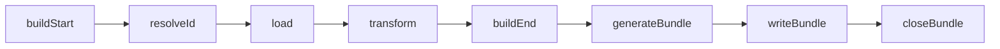
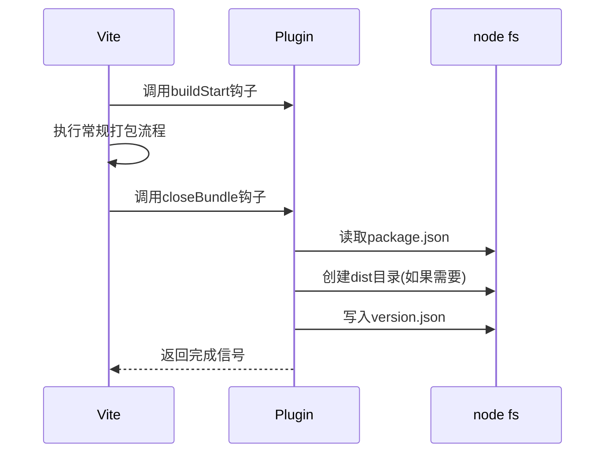

# B端项目版本同步方案：基于Vite插件的自动化实践

## 我遇到的需求

在公司的B端系统开发中，我们遇到了一个比较实际的痛点。我们卖给客户的系统包含多个项目：管理后台、Pad端、大屏展示，还有各种后端服务。每次迭代更新后，客户那边出问题，实施同事一问三不知——他们根本分不清各个部分现在是什么版本。更麻烦的是，我们还有标准版和一堆定制版，版本管理乱成一锅粥。

这时候我就想，**能不能让每个前端项目在打包时自动生成一个版本文件**？然后主项目一启动，就能把这些版本信息收集起来展示？这样不管是客户反馈问题，还是我们自己排查，都能一目了然。

> 这个方案其实也适用于其他多项目集成的场景，比如微前端架构。

## 问题场景分析

先看看我们的项目结构：

    成套系统（Vue + Vite）
    └── 前端主项目-管理后台
    └── 前端Pad
    └── 前端大屏
    └── 控制服务
    └── 后端服务
    └── 数据中心
    └── ......

目前主系统中是这样的，但还需要添加大屏等前端项目。


**我要解决的核心问题：**

1.  前端部分的项目构建时自动生成版本信息文件
2.  整个过程自动化，减少人工干预，让自己轻松点

> 至于版本同步，则是在主项目中fetch版本信息文件，然后展示。因此，这里重点直接就讲下怎么写这个Vite插件。

**思路其实很明确：**

既然都用Vite打包，那就写个插件呗！在打包完成的钩子里把版本信息写到dist目录，主项目启动后去拉取这些文件展示出来。简单直接！

## 动手写Vite插件

Vite插件是基于Rollup的插件系统扩展，可以有两种形式：

*   一种是vite插件，仅供vite使用；
*   另一种是rollup通用插件，它不使用Vite特有的钩子（`config`、`configResolved`、`configureServer`、`configurePreviewServer`、`transformIndexHtml`、`handleHotUpdate`）。

### Vite插件结构

从Vite文档就可以知道，一个基本的Vite插件需要包含以下部分：

```javascript
export default function myVitePlugin() {
  return {
    name: 'vite-plugin-name', // 插件名称
    apply: 'build' | 'serve' | 'both', // 插件的入口点，会调用每个插件的apply函数，传入Vite的配置对象
    // 各种钩子函数
    config() {}, // 允许插件修改配置并返回新的配置
    transform() {}, // 开发阶段调用，请求插件对特定文件进行转换。
    closeBundle() {} // 打包完成后触发
  }
}
```

### 插件生命周期

关键钩子函数有：

1.  **配置阶段**：
    *   `config`：修改Vite配置
    *   `configResolved`：配置解析完成后

2.  **开发服务器**：
    *   `configureServer`：添加自定义中间件
    *   `transformIndexHtml`：修改HTML内容

3.  **构建过程**：
    *   `buildStart`：构建开始
    *   `resolveId`：解析模块路径
    *   `load`：加载模块内容
    *   `transform`：转换代码
    *   `buildEnd`：构建结束
    *   `generateBundle`：生成输出时处理
    *   `writeBundle`：将bundle写入磁盘
    *   `closeBundle`：资源写入完成

在构建流程中，各钩子的执行顺序如下：



显然，我们应该选择`closeBundle`钩子，因为：此时所有bundle已写入磁盘，dist目录结构已确定，我们可以安全地添加额外文件，也不用修改打包出来的资源。

### 插件核心实现

我们开发的版本同步插件主要功能是在构建完成后生成版本信息文件：

```javascript
import fs from "fs/promises";
import fsExtra from "fs-extra";
import path from "path";
import { fileURLToPath } from "url";

// 格式化日期为 YYYY-MM-DD HH:mm:ss
function formatDate(date = new Date()) {
  const pad = (num) => String(num).padStart(2, "0");
  return (
    [date.getFullYear(), pad(date.getMonth() + 1), pad(date.getDate())].join("-") +
    " " +
    [pad(date.getHours()), pad(date.getMinutes()), pad(date.getSeconds())].join(":")
  );
}

// 生成版本信息
async function generateVersionInfo(pkgPath, distDir) {
  try {
    const pkg = JSON.parse(await fs.readFile(pkgPath, "utf-8"));
    const versionInfo = {
      name: pkg.name,
      version: pkg.version,
      buildTime: formatDate(),
      dependencies: pkg.dependencies || {},
    };

    const outputPath = path.join(distDir, "version.json");
    await fs.writeFile(outputPath, JSON.stringify(versionInfo, null, 2));

    return versionInfo;
  } catch (err) {
    console.error("生成版本信息失败:", err.message);
    throw err;
  }
}

export default function vitePluginVersion(options = {}) {
  return {
    name: "vite-plugin-archive",
    apply: "build",
    async closeBundle() {
      try {
        const __dirname = path.dirname(fileURLToPath(import.meta.url));
        const pkgPath = path.join(__dirname, "package.json");
        const distDir = path.join(__dirname, "dist");

        await fsExtra.ensureDir(distDir);
        await generateVersionInfo(pkgPath, distDir);
      } catch (error) {
        console.error("❌ 插件执行失败:", error.message);
        process.exitCode = 1;
      }
    },
  };
}

```

写这个插件的时候，有几个地方需要特别注意：

**1. 路径处理**

在Node环境里，`__dirname` 这个变量在ESM模块中是不能直接用的。所以得绕个弯子：

```javascript
// 先拿到当前文件的URL
const __dirname = path.dirname(fileURLToPath(import.meta.url));
```

这样处理完，无论项目在Windows还是Linux下跑，路径都不会出问题。

**2. 执行时机**

最开始我试过在`buildEnd`钩子里写文件，结果发现dist目录还没生成，此时插件中创建的dist会被后写入的覆盖掉。

换成`closeBundle`后就没毛病————这个钩子触发的时候，Vite已经把打包文件全写进dist了，这个时候适合写入额外文件。

**3. 异常处理**

文件操作随时可能出问题：可能没权限，亦或者可能磁盘满了。所以整个操作用try-catch包起来，就算出错也不会导致整个构建崩掉。

### 构建流程时序图

然后，这个构建过程的时序图大概就是下面这样，看着就很清晰了！



## 继续扩展下

### 添加压缩功能

项目版本比较多，有些版本没配jenkins，所以免不了会给测试打个包。因此，还可以扩展下插件功能，在生成版本文件后自动压缩dist目录：

```javascript
// 在插件中添加
import archiver from "archiver";

// 打包目录 默认zip压缩
async function packDist(sourceDir, outPath, format = "zip") {
  try {
    await fsExtra.ensureDir(path.dirname(outPath));
    const output = fsExtra.createWriteStream(outPath);

    const archive = archiver(format, {
      zlib: { level: 9 },
      statConcurrency: 4, // 并发统计文件信息
    });

    archive.pipe(output);
    archive.glob("**/*", {
      cwd: sourceDir,
      ignore: [
        // 忽略掉这些
        "**/node_modules/**",
        "**/*.log",
        "**/.DS_Store",
        "**/Thumbs.db",
      ],
      dot: true,
    });

    await archive.finalize();
    return outPath;
  } catch (err) {
    throw err;
  }
}
```

### 构建缓存优化

我们还可以利用Vite的缓存机制加速构建，在`configResolved`钩子中使缓存版本信息，然后就不用在`closeBundle`中重复读取：

```javascript
export default function vitePluginArchive() {
  let cachedPkg = null;
  
  return {
    name: "vite-plugin-archive",
    apply: "build",
    configResolved(config) { // 在配置解析后缓存版本信息
      const pkgPath = path.resolve(config.root, 'package.json');
      const pkg = JSON.parse(fs.readFileSync(pkgPath, 'utf-8'));
      cachedPkg = pkg;
    },
    closeBundle() {
      // 使用缓存版本，避免重复读取文件
      const pkg = cachedPkg;
      // 省略其余逻辑啦
    }
  }
}
```

这里其实也没太有必要，单纯是为了干中学！对于一开始的需求，已经是完全满足啦！

## 参考资料

1.  [Vite官方插件API文档](https://vitejs.dev/guide/api-plugin.html)
2.  [Rollup插件开发手册](https://rollupjs.org/guide/en/#plugin-development)
3.  [Node.js文件系统最佳实践](https://nodejs.org/api/fs.html)
4.  [Vite插件生命周期了解](https://juejin.cn/post/7388057629774282778)

## 源码

1.  [vite-plugin-archive](https://github.com/BertRepo/vite-plugin-archive)

如果你觉得还有一点点🤏意思，恳请您点点赞和收藏吧🎊～
