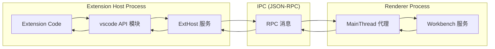

# 浅析vscode整体架构和插件开发原理

VS Code 插件（Extension）本质上是一个「带 package.json 清单 + Node.js 入口脚本 + VS Code API 调用」的 npm 包，被 VS Code 放在独立的 Extension Host 进程里，通过 RPC 调用和主进程 / 渲染进程通信，从而扩展编辑器的能力。核心就是三件事：**声明（package.json）+ 激活（Activation Events）+ 注册/实现（Contribution Points + VS Code API）**。
下面按层次拆开说。
---
## 1. 整体架构：插件在 VS Code 里的位置
VS Code 是多进程架构，插件跑在一个独立的 **Extension Host 进程**里：  
- Main Process：主进程，负责窗口、生命周期、文件对话框等，有完整 Node.js 权限。  
- Renderer Process：渲染 UI（Workbench），跑在 Chromium 沙箱里。  
- **Extension Host Process**：专门的 Node.js 进程，用来加载和运行所有扩展，崩溃不会拖垮 UI。
插件和 UI 的通信路径大致是这样：

- 你在插件里 `import * as vscode from 'vscode'` 调的各种 API，其实是通过 **RPC 代理** 转到 Renderer/主进程里的真实服务执行。
---
## 2. 插件长什么样？——文件结构 & package.json
### 2.1 典型目录结构
官方示例的 Hello World 扩展结构大致是：
```text
.
├── .vscode/
│   ├── launch.json     # 调试扩展的配置
│   └── tasks.json      # 编译任务等
├── src/
│   └── extension.ts    # 扩展入口源码
├── package.json        # 扩展清单（最重要）
├── tsconfig.json       # TS 编译配置
└── README.md
```
- 关键文件：**`package.json`（扩展清单） + 入口文件（`extension.ts` / `extension.js`）**。
### 2.2 package.json：扩展清单（Manifest）
每个扩展必须在根目录有一个 `package.json`，既包含普通 npm 字段，又有 VS Code 专用字段：
核心字段：
- `name`, `publisher`：合起来构成扩展 ID：`publisher.name`，全局唯一。
- `version`：语义版本。
- `engines.vscode`：依赖的 VS Code 最低版本。
- `main`：扩展入口文件路径，如 `"./out/extension.js"`。
- `activationEvents`：**激活事件数组**，告诉 VS Code “在什么情况下才加载我这个插件”。
- `contributes`：**贡献点**，声明你要扩展 VS Code 的哪些地方（命令、菜单、语言、主题等）。
- `dependencies` / `devDependencies`：普通 npm 依赖。
一个极简示例（简化版）：
```jsonc
{
  "name": "helloworld-sample",
  "publisher": "vscode-samples",
  "version": "0.0.1",
  "engines": { "vscode": "^1.51.0" },
  "activationEvents": [],
  "main": "./out/extension.js",
  "contributes": {
    "commands": [
      {
        "command": "helloworld.helloWorld",
        "title": "Hello World"
      }
    ]
  }
}
```
---
## 3. 插件是怎么被“激活”的？——Activation Events
VS Code 为了性能，不会一上来就加载所有插件，而是按需加载。你通过 `activationEvents` 声明“什么时候激活我”。
常见激活事件：
- `"onLanguage:python"`：打开 Python 文件时激活。  
- `"onCommand:extension.sayHello"`：执行某个命令时激活。  
- `"onDebug"`：启动调试时激活。  
- `"workspaceContains:**/.editorconfig"`：工作区包含某类文件时激活。  
- `"onView:nodeDependencies"`：某个侧边栏视图被展开时激活。  
- `"onStartupFinished"`：VS Code 启动完成后激活（类似后台服务）。  
- `"*"`：立即激活（不推荐，会拖慢启动）。
从 VS Code 1.74 开始，很多贡献点自带的激活事件可以省略，例如你在 `contributes.commands` 里声明了命令，会自动激活，不用再写 `onCommand:xxx`。
---
## 4. 插件怎么扩展 VS Code？——Contribution Points + VS Code API
官方把插件能力拆成两块：
- **Contribution Points（贡献点）**：在 `package.json` 里静态声明我要扩展什么。
- **VS Code API**：在运行时通过代码动态注册行为、处理事件等。
### 4.1 Contribution Points：静态声明扩展点
在 `contributes` 字段里可以声明很多扩展点，例如：
- `commands`：注册命令，会出现在命令面板。
- `menus`：在编辑器右键菜单、标题栏菜单等地方添加菜单项。
- `keybindings`：绑定快捷键。
- `languages`：新语言（ID、后缀名、语法文件等）。
- `grammars`：TextMate 语法高亮。
- `snippets`：代码片段。
- `debuggers`：调试器集成。
- `themes`, `iconThemes`：颜色主题、文件图标主题。
- `configuration`：扩展的设置项，会出现在 VS Code Settings 里。
- `views`, `viewsContainers`：侧边栏/面板中的自定义视图。
示例：在 `package.json` 中注册命令并配置菜单和快捷键：
```jsonc
"contributes": {
  "commands": [
    {
      "command": "extension.sayHello",
      "title": "Say Hello"
    }
  ],
  "menus": {
    "editor/context": [
      {
        "command": "extension.sayHello",
        "group": "navigation"
      }
    ]
  },
  "keybindings": [
    {
      "command": "extension.sayHello",
      "key": "ctrl+f1",
      "mac": "cmd+f1"
    }
  ]
}
```
### 4.2 VS Code API：运行时逻辑
入口文件导出两个函数：
```ts
import * as vscode from 'vscode';
export function activate(context: vscode.ExtensionContext) {
  // 扩展被激活时调用
  console.log('Extension is now active!');
  const disposable = vscode.commands.registerCommand(
    'extension.sayHello',
    () => {
      vscode.window.showInformationMessage('Hello World!');
    }
  );
  context.subscriptions.push(disposable);
}
export function deactivate() {
  // 扩展被停用时做清理
}
```
`vscode` 模块提供了很多命名空间，比如：
- `vscode.commands`：注册/执行命令。
- `vscode.window`：信息提示、输入框、快速选择等 UI。
- `vscode.workspace`：工作区、文件、配置、文本文档等。
- `vscode.languages`：代码补全、诊断、格式化等语言特性。
- `vscode.debug`：调试相关。
典型玩法：
- 注册命令：`vscode.commands.registerCommand(...)`。
- 监听事件：`vscode.workspace.onDidChangeTextDocument(...)`。
- 创建 WebView 面板：`vscode.window.createWebviewPanel(...)`。
- 提供补全项：`vscode.languages.registerCompletionItemProvider(...)`。
---
## 5. 插件是怎么运行和隔离的？
从架构层面看，插件的大致生命周期是：
1. VS Code 启动，Main Process 创建 Renderer 进程和 Extension Host 进程。
2. Extension Host 扫描 `~/.vscode/extensions` 等扩展目录，读取每个扩展的 `package.json`。
3. 根据扩展的 `activationEvents`，在合适的事件发生时：
   - 加载扩展的 `main` 入口模块（Node.js）。
   - 调用模块的 `activate()` 函数。
4. 扩展在 `activate()` 中通过 VS Code API 注册各种功能。
5. 后续用户操作触发命令、打开文档、触发事件等，扩展的回调被执行。
6. VS Code 关闭或扩展被禁用/卸载时，调用 `deactivate()` 做清理。
关键点：
- **隔离性**：扩展跑在独立的 Extension Host 进程，一个扩展死掉不会直接拖垮 UI 进程。
- **异步通信**：扩展和主进程/渲染进程之间通过 JSON-RPC IPC 异步通信，API 大多是 Promise 形式。
---
## 6. 插件是怎么打包和发布的？
官方提供命令行工具 `vsce`：
1. 安装：
   ```bash
   npm install -g @vscode/vsce
   ```
2. 打包成 `.vsix`：
   ```bash
   cd my-extension
   vsce package
   # 生成 my-extension-0.0.1.vsix
   ```
3. 发布到 VS Code Marketplace：
   ```bash
   vsce publish
   ```
发布前需要：
- 在 Azure DevOps 创建 Personal Access Token，并创建一个 publisher（`package.json` 里的 `publisher` 字段）。
用户安装 `.vsix`：
- 在扩展视图里选择 “Install from VSIX…”，或命令行：`code --install-extension xxx.vsix`。
---
## 7. 一个完整插件从 0 到 1 的最小流程
结合上面内容，一个插件的开发流程通常是：
1. 用 Yeoman 生成器创建脚手架（`yo code`），或手动创建项目。
2. 编写 `package.json`，声明：
   - 基本信息（name、publisher、version）。
   - `engines.vscode`。
   - `activationEvents`。
   - `contributes`（commands、menus、languages 等）。
3. 编写入口文件 `extension.ts`，导出 `activate` 和 `deactivate`：
   - 使用 `vscode.commands.registerCommand` 注册命令逻辑。
   - 使用 `vscode.languages.*` 注册语言特性。
   - 使用 `vscode.window.createWebviewPanel` 等创建 UI。
4. 使用 TypeScript 编译到 `out/` 目录（`"main": "./out/extension.js"`）。
5. 按 F5 在“扩展开发宿主”中调试扩展。
6. 使用 `vsce package` 打包，`vsce publish` 发布到市场。
---
如果你愿意，我可以基于你具体想做的功能（比如“做一个代码片段插件”、“做一个语言服务”、“做一个自定义视图”等），给一个更针对性的实现路径和示例代码结构。
